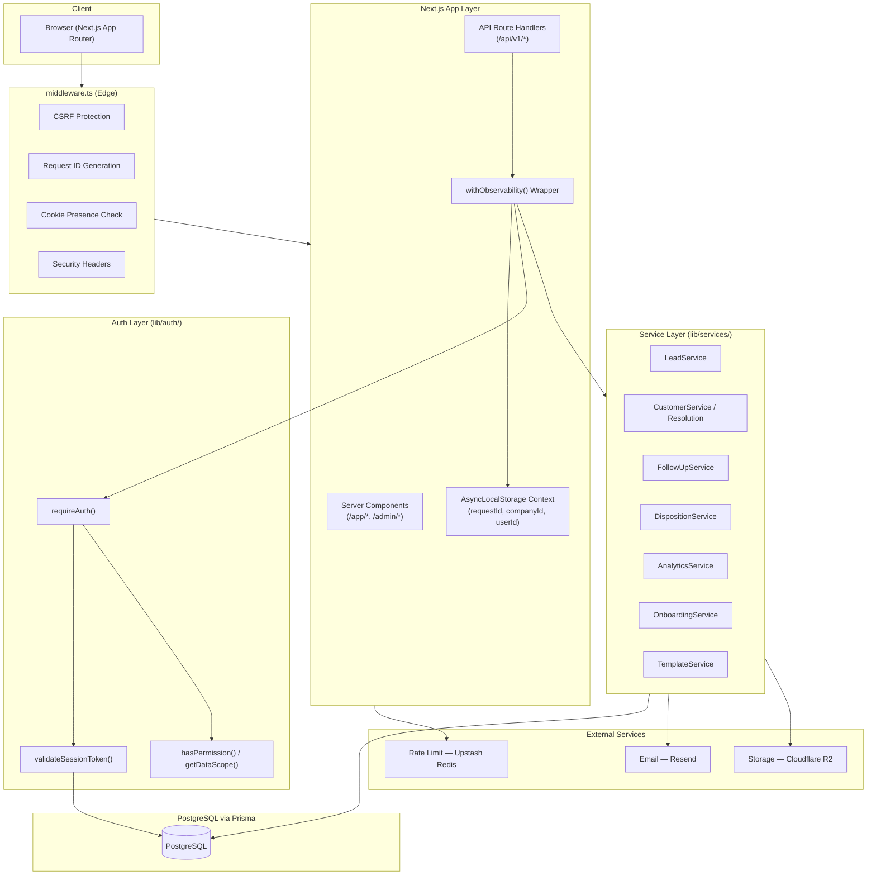
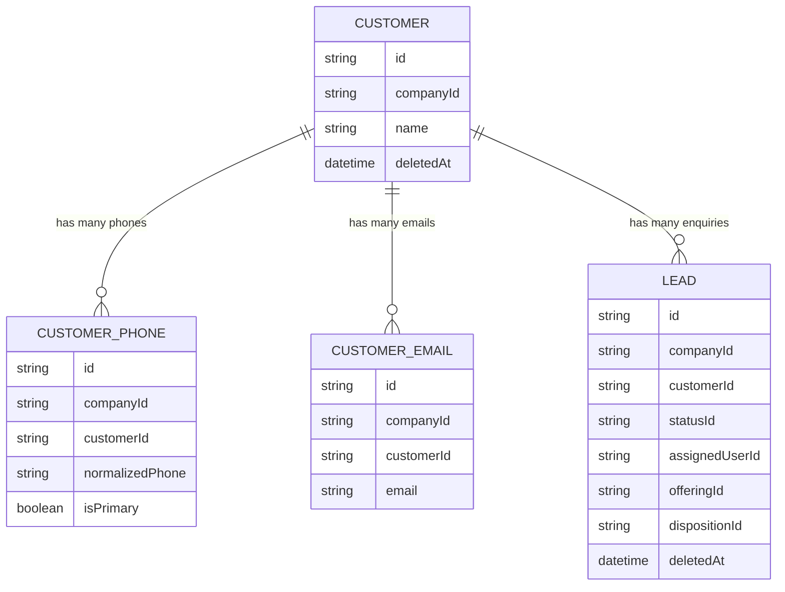
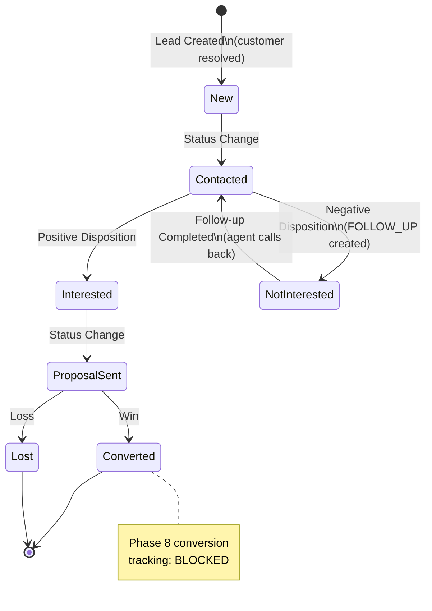
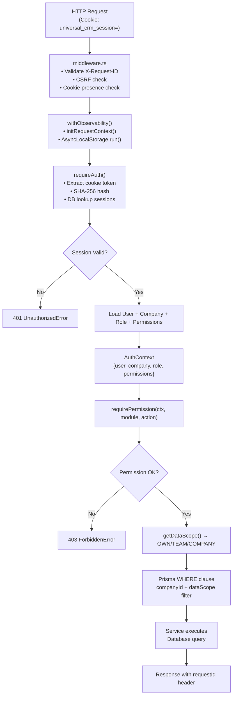
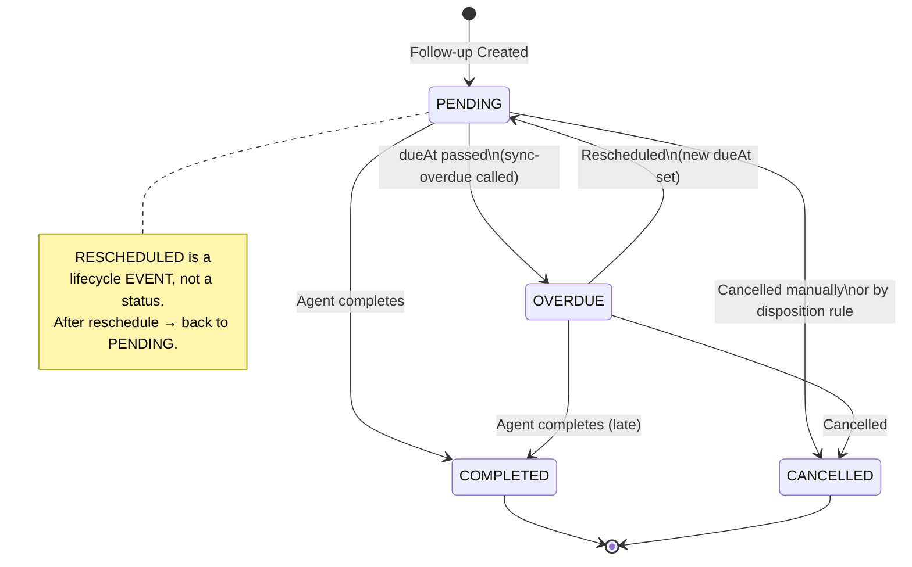
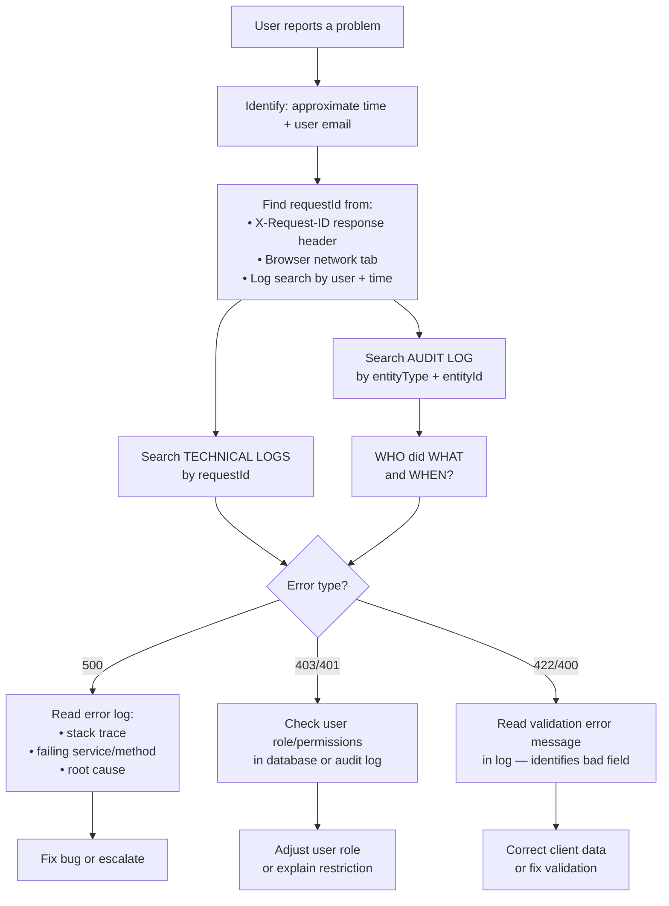

# Universal CRM — Master System Guide

> **Version**: B.7.5 — Post-Hardening Canonical Reference
> **Status**: VERIFIED FROM CODE — All claims traced to actual repository files
> **Phase 8**: BLOCKED / UNTOUCHED — Not documented as implemented
> **Read-only**: This document does not modify application code

---

## Table of Contents

1. [Product Overview](#1-product-overview)
2. [Core CRM Concepts](#2-core-crm-concepts)
3. [Complete CRM Lifecycle](#3-complete-crm-lifecycle)
4. [Customer Identity System](#4-customer-identity-system)
5. [Enquiry / Lead System](#5-enquiry--lead-system)
6. [Custom Fields](#6-custom-fields)
7. [Offerings](#7-offerings)
8. [Dispositions](#8-dispositions)
9. [Follow-Up / Task System](#9-follow-up--task-system)
10. [Onboarding](#10-onboarding)
11. [Industry Templates](#11-industry-templates)
12. [Authentication](#12-authentication)
13. [Authorization Model](#13-authorization-model)
14. [Super Admin](#14-super-admin)
15. [Dashboard / Analytics](#15-dashboard--analytics)
16. [Audit System](#16-audit-system)
17. [Technical Logging](#17-technical-logging)
18. [Request ID Troubleshooting](#18-request-id-troubleshooting)
19. [Storage / Files](#19-storage--files)
20. [Email, Rate Limiting & External Providers](#20-email-rate-limiting--external-providers)
21. [Security Architecture](#21-security-architecture)
22. [Database Model](#22-database-model)
23. [API Map](#23-api-map)
24. [UI Map](#24-ui-map)
25. [Business Rules / Invariants](#25-business-rules--invariants)
26. [Current Implementation Status](#26-current-implementation-status)
27. [Known Limitations / Technical Debt](#27-known-limitations--technical-debt)
28. [Phase History](#28-phase-history)
29. [Real Company Operating Model](#29-real-company-operating-model)
30. [New Developer Quick Start](#30-new-developer-quick-start)
31. [New Admin Quick Start](#31-new-admin-quick-start)
32. [New Agent Quick Start](#32-new-agent-quick-start)
33. [AI Agent Quick Start](#33-ai-agent-quick-start)
34. [Visual Diagrams](#34-visual-diagrams)

---

## 1. Product Overview

### What Universal CRM Is

Universal CRM is a **multi-tenant, industry-agnostic customer relationship management platform** built on Next.js 16, PostgreSQL (via Prisma 5), and deployed as a Node.js application. It enables businesses of any type — sales teams, real estate agencies, healthcare clinics, educational institutions — to:

- Track customer enquiries from initial contact through resolution
- Manage a catalog of products or services (Offerings)
- Assign work to sales agents and teams
- Capture call outcomes via a configurable Disposition hierarchy
- Schedule follow-ups and general tasks
- Measure team performance through analytics

### What Problem It Solves

Many businesses receive enquiries (leads) from multiple sources — website, ads, walk-in, phone — and lose track of them. Universal CRM provides a **central workspace** where:

- Every customer has a permanent record
- Every enquiry is tracked independently
- Agents log their interactions (calls, WhatsApp, email, meetings)
- Managers see team performance
- Administrators control who can see and do what

### Who Uses It

| Role | Description |
|------|-------------|
| **Super Admin** | Platform operator; manages companies across the entire platform |
| **Company Admin** | Tenant administrator; configures the CRM, invites users, manages settings |
| **Manager / Team Lead** | Manages a team's leads and performance; TEAM-scoped data access |
| **Sales Rep / Agent** | Handles enquiries assigned to them; OWN-scoped data access |
| **Viewer** | Read-only access to company data |
| **Support** | Can view and log activities/notes across the company |

### What a Company / Tenant Means

A **Company** is the root unit of tenancy. Every piece of CRM data — customers, leads, users, teams, settings, dispositions, offerings — belongs to exactly one Company. Companies are completely isolated from each other at the database query level via `companyId` on every entity. One Company cannot see another Company's data under any circumstance.

### Roles Explained

- **Super Admin**: No company context. Manages the platform fleet. Stored in a completely separate `super_admins` database table and uses a separate session cookie (`universal_crm_superadmin_session`). Cannot accidentally act as a tenant user.
- **Company Admin**: Has the `Admin` system role within their company. Full `manage` permissions on all modules with `COMPANY` data scope.
- **Manager**: Has `TEAM` data scope on leads, tasks, and activities. Cannot manage settings or users.
- **Sales Rep**: Has `OWN` data scope on leads, tasks, and activities. Handles their own assigned enquiries.
- **Viewer**: Read-only company-wide access.
- **Support**: Can view and create activities/notes company-wide.

> **Note**: Role names (Admin, Manager, Sales Rep, etc.) are seeded as system roles. Business logic does **not** hardcode role-name checks — all checks go through the `Permission` table via `authorize()`. Custom roles can be created.

---

## 2. Core CRM Concepts

### The Most Important Invariant

> **ONE CUSTOMER ≠ ONE ENQUIRY**
>
> A Customer is a long-term identity. An Enquiry is a single business interaction. One customer can have many enquiries.

### Concrete Example

```
Rahul Sharma (Customer — permanent identity)
 ├── Enquiry #1 → Television → Status: Converted/Won   (closed)
 ├── Enquiry #2 → Mobile Phone → Status: Open          (active)
 └── Enquiry #3 → Air Conditioner → Status: Lost       (closed)
```

Rahul's complete history is visible when viewing any of his enquiries. Each enquiry is independent — winning enquiry #1 does not affect enquiry #2. Losing enquiry #3 does not affect enquiry #2.

### Entity Glossary

| Entity | What It Is |
|--------|------------|
| **Company** | The tenant root. All data belongs to one company. |
| **Customer** | Long-term identity of a person/organization. Has phones and emails. Persists across all their enquiries. |
| **Enquiry / Lead** | A single business interaction request. The primary CRM working unit. Backed by the `Lead` database table. |
| **User** | An employee of the company using the CRM. Has a role and permissions. |
| **Team** | A group of users under a manager. Enables TEAM-scoped data access. |
| **Offering** | A product or service from the company's catalog (e.g., Television, Insurance Plan, Flat 3BHK). |
| **Activity** | An auto-recorded event on an enquiry timeline (call, WhatsApp, email, meeting, note, disposition change, status change). |
| **Task** | A scheduled action. Type is either `FOLLOW_UP` (tied to the follow-up lifecycle engine) or `GENERAL` (independent). |
| **Follow-Up** | A `Task` of type `FOLLOW_UP`. Governs the call-back discipline. At most ONE active follow-up per enquiry at any time. |
| **Disposition** | An arbitrary-depth hierarchical outcome categorization (e.g., "Not Interested → Price Too High"). Controls what happens after an agent records a call outcome. |
| **Status** | A pipeline stage label for an enquiry (New, Contacted, Interested, Proposal Sent, Converted, Lost). Company-configurable. |
| **Custom Field** | An admin-defined additional data field for an enquiry (e.g., "Budget Range", "Property Type"). |
| **Audit Log** | An immutable record of **who did what** in the CRM. For business accountability. |
| **Platform Audit Log** | An immutable record of Super Admin platform operations. Isolated from tenant audit logs. |

---

## 3. Complete CRM Lifecycle

### Enquiry Lifecycle (Implemented)

```
[External Enquiry Received]
         ↓
  [Lead/Enquiry Created]
  - Customer resolved or created
  - Source assigned (Website, Google Ads, etc.)
  - Status = New (default)
  - Offering optionally assigned
  - Custom fields populated
         ↓
  [Assignment]
  - Assigned to Sales Rep or Team
         ↓
  [First Contact Attempt]
  - Agent logs activity: CALL / WHATSAPP / EMAIL
  - Agent selects Disposition (call outcome)
         ↓
  [Disposition Recorded]
  - If requiresFollowUp=true: Follow-up created
  - If cancelActiveFollowUp=true: Existing follow-up cancelled
  - Disposition history recorded (immutable)
         ↓
  [Follow-Up Scheduled]
  - Single active FOLLOW_UP task per enquiry
  - PENDING → OVERDUE if dueAt passes without completion
         ↓
  [Follow-Up Due / Agent Calls Back]
  - Agent logs activity
  - Agent selects new Disposition
         ↓
  [Cycle repeats until terminal outcome]
         ↓
  [Status → Converted | Won | Lost]
  - Enquiry is effectively closed
  - History is preserved
  - Customer record remains for future enquiries
```

### Implementation Status of Lifecycle Stages

| Stage | Status | Notes |
|-------|--------|-------|
| Lead creation | IMPLEMENTED | Via API + CSV import |
| Customer resolution | IMPLEMENTED | Phone-based E.164, explicit ID |
| Source assignment | IMPLEMENTED | Company-configurable |
| Status pipeline | IMPLEMENTED | Company-configurable |
| Offering assignment with pricing | IMPLEMENTED | Price override with permission |
| Custom fields | IMPLEMENTED | 11 field types |
| Assignment to user/team | IMPLEMENTED | With history tracking |
| Activity logging | IMPLEMENTED | CALL, WHATSAPP, EMAIL, MEETING, NOTE |
| Disposition recording | IMPLEMENTED | Arbitrary-depth hierarchy |
| Follow-up scheduling | IMPLEMENTED | One active per enquiry |
| Overdue detection | IMPLEMENTED | Atomic status sync |
| Rescheduling follow-ups | IMPLEMENTED | With history trail |
| Lead deletion (soft) | IMPLEMENTED | `deletedAt` pattern |
| Lead export | IMPLEMENTED | CSV with formula injection protection |
| Lead import | IMPLEMENTED | CSV bulk with error reporting |
| **Phase 8 — Conversion Lifecycle** | **BLOCKED** | Not implemented. Do not activate. |

---

## 4. Customer Identity System

### Overview

A **Customer** is the long-term identity of a person or organization within a tenant company. The `Customer` record persists permanently — it is never deleted when an enquiry is lost. This enables multi-enquiry history and relationship tracking.

**Source of truth**: `lib/services/customer-resolution.service.ts`

### Phone Normalization

All phone numbers are normalized to **E.164 format** (e.g., `+919876543210`) before storage. The normalization uses a `PhoneNormalizer` utility with a tenant-configured default country code (`company.defaultCountryCode`, default: `"IN"`).

```
User enters: 9876543210
Tenant country: IN
Normalized:   +919876543210
```

### Tenant-Scoped Identity

Phone uniqueness is enforced **within a company**, not globally:
- `CustomerPhone` has a `@@unique([companyId, normalizedPhone])` constraint.
- The same phone number can exist for different customers in different companies.
- Within one company, a normalized phone can only be owned by one active customer.

### Customer Resolution Priority

When creating an enquiry, the system resolves or creates a customer using this priority:

1. **Explicit customerId provided** → Validates that the customer belongs to this company. Rejects with `ConflictError` if supplied phone belongs to a different customer.
2. **rawPhone provided** → Normalizes to E.164, searches `CustomerPhone` in company scope. If found → returns existing customer. If not found → atomically creates new Customer + CustomerPhone (+ CustomerEmail if provided).
3. **Name only (no phone)** → Creates a standalone customer without phone identity.
4. **None of the above** → Throws `ValidationError`.

### Multiple Phones and Emails

A customer can have multiple `CustomerPhone` and `CustomerEmail` records. Each phone has a `type` (MOBILE, WORK, HOME, WHATSAPP) and an `isPrimary` flag. The `isPrimary` phone is the default contact method.

### Soft-Deleted Customers

Customers are soft-deleted via `deletedAt`. A soft-deleted customer's historical enquiries remain linked. When a phone number previously belonging to a soft-deleted customer is encountered during new enquiry creation, the phone ownership is **reassigned** to the new customer and the reassignment is **audited** (`customer_phone.reassigned`).

### No Automatic Merge / Customer Merge Status

The system never automatically merges two distinct customer records. If two records share similar information but have different `id` values, they remain separate.
- **Customer Merge is DEFERRED**: Merging two separate customer identities (including merging phones, emails, and enquiry history) is planned for a future milestone. No API or UI currently exists for identity merging.
- **Enquiry Link/Unlink IS SUPPORTED**: Agents and admins can link or unlink existing enquiries to/from customer identities via `LeadService.linkCustomer` / `LeadService.unlinkCustomer`.

### Customer Conflict Handling

If a client explicitly provides `customerId = Customer A` but the phone number belongs to `Customer B`, the system rejects the request with `ConflictError`. It never silently reassigns ownership.

---

## 5. Enquiry / Lead System

### Physical Backing

Enquiries are stored in the `leads` database table (Prisma model: `Lead`). The business layer refers to them as "Enquiries" in user-facing language but the data model uses "Lead" for backward compatibility. Both terms are equivalent in this codebase.

**Source of truth**: `lib/services/lead.service.ts` (47KB — the largest service file)

### Lead Fields

| Field | Description |
|-------|-------------|
| `name` | Enquiry title / customer name at the time of creation |
| `email` | Lead-level contact email (not globally unique — denormalized for quick access) |
| `phone` | Lead-level contact phone (not globally unique — denormalized for quick access) |
| `company` | Lead's organization name (not the CRM tenant company) |
| `customerId` | FK to the resolved Customer identity |
| `sourceId` | FK to LeadSource (Website, Google Ads, etc.) |
| `statusId` | FK to LeadStatus (pipeline stage) |
| `assignedUserId` | FK to the responsible Sales Rep |
| `teamId` | FK to the assigned Team |
| `priority` | LOW / MEDIUM / HIGH / URGENT |
| `offeringId` | FK to the selected Offering |
| `defaultPriceAtCreation` | Snapshot of the offering's price at enquiry creation |
| `quotedPrice` | The price actually quoted to the customer |
| `priceOverridden` | Boolean flag — true if the quoted price differs from the default |
| `priceOverrideReason` | Reason for price override |
| `dispositionId` | FK to the most recent Disposition |
| `deletedAt` | Soft-delete timestamp — all normal queries filter `WHERE deletedAt IS NULL` |

### Lead History Records

All state changes are tracked in immutable history tables:

- `LeadStatusHistory` — every status transition (from, to, who, when)
- `LeadAssignmentHistory` — every assignment change (from user, to user, who assigned, when)
- `LeadDispositionHistory` — every disposition change with optional notes, reason, and follow-up task link

### Activities

The `Activity` table records every significant action on a lead timeline:

| Activity Type | Triggered When |
|---------------|---------------|
| `LEAD_CREATED` | Lead is created |
| `LEAD_UPDATED` | Lead fields are updated |
| `LEAD_DELETED` | Lead is soft-deleted |
| `STATUS_CHANGED` | Pipeline status changes |
| `ASSIGNED` / `REASSIGNED` | Lead assigned or reassigned |
| `NOTE_ADDED` / `NOTE_UPDATED` / `NOTE_DELETED` | Notes |
| `TASK_CREATED` / `TASK_COMPLETED` / `TASK_CANCELLED` | Task lifecycle |
| `CALL` / `WHATSAPP` / `EMAIL` / `MEETING` | Agent-logged contact |
| `DISPOSITION_CHANGED` | Disposition recorded |
| `TASK_RESCHEDULED` | Follow-up rescheduled |

### Lead Import

Bulk CSV import is supported via `lead-import.service.ts`. An import job tracks:
- `totalRows`, `successfulRows`, `skippedRows`, `updatedRows`, `failedRows`
- Status: `PROCESSING → COMPLETED | COMPLETED_WITH_ERRORS | FAILED`

### Lead Export

CSV export with formula injection sanitization (to prevent spreadsheet macro attacks). Respects the user's data scope — an agent with OWN scope only exports their own leads.

---

## 6. Custom Fields

### What They Are

Custom Fields are **admin-defined additional data fields** that extend an enquiry record beyond the built-in fields. For example, a real estate company might add "Property Type", "Budget Range", and "Preferred Location".

**Source of truth**: `lib/services/custom-field.service.ts`

### Supported Field Types

Verified from `prisma/schema.prisma` (`CustomFieldType` enum):

| Type | Description |
|------|-------------|
| `TEXT` | Single-line text input |
| `TEXTAREA` | Multi-line text |
| `NUMBER` | Numeric value |
| `DATE` | Date only |
| `DATETIME` | Date and time |
| `BOOLEAN` | True/False toggle |
| `SELECT` | Single selection from a list |
| `MULTI_SELECT` | Multiple selections from a list |
| `URL` | URL input |
| `EMAIL` | Email address input |
| `PHONE` | Phone number input |

### Configuration

- Each custom field has a `key` (snake_case, unique within `companyId + entityType`), a `label`, a `fieldType`, and optional `options` (for SELECT/MULTI_SELECT).
- Fields can be marked `required` — this is enforced server-side during lead creation/update.
- Fields have a `sortOrder` for display ordering.
- Fields can be `active` or inactive. Inactive fields are hidden from agents but their values are preserved.
- Entity type is always `"LEAD"` for the current implementation (customer-level custom fields are in schema but not surfaced via API — NOT VERIFIED as available).

### Storage Model

- Schema definitions: `custom_fields` table, owned by `companyId`.
- Values: `custom_field_values` table, keyed by `(companyId, customFieldId, entityId)`. The `value` column is JSON for flexibility.

### Tenant Ownership

Custom fields are strictly tenant-scoped. No company can see another's custom field definitions or values.

### Permission Enforcement

- Viewing fields: requires `custom_fields.view` or `settings.view`.
- Creating/updating/deleting fields: requires `custom_fields.manage` or `settings.manage` (Admin role).
- Agents with `custom_fields.view` can view definitions and fill in values.

---

## 7. Offerings

### What an Offering Is

An **Offering** is a product or service in the company's catalog that can be linked to an enquiry. Examples: "65" Smart TV", "Term Insurance Plan", "2BHK Flat — Baner Pune", "Physics Tuition Grade 11".

**Source of truth**: `lib/services/offering.service.ts`

### Offering Fields

| Field | Description |
|-------|-------------|
| `name` | Display name |
| `type` | `PRODUCT` or `SERVICE` |
| `code` | Optional short code (SKU) |
| `description` | Long description |
| `defaultPrice` | Catalog default price (Decimal 15,2) |
| `currency` | ISO currency code stored with the offering (e.g., `"USD"`, `"INR"`) |
| `isActive` | Whether the offering is available for selection |
| `allowSalesPriceOverride` | Whether the price can be overridden on an enquiry |

### Currency Hierarchy

1. The `Offering.currency` field stores the currency for that specific offering.
2. The `Company.currency` field is the company-default currency.
3. When an offering is attached to a lead, `defaultPriceAtCreation` is snapshot at that moment.
4. **If currency is missing from an offering, the API rejects it** — there is no silent USD/INR fallback. The database-level `@default("USD")` on `Offering.currency` has been removed via migration `20260929080000_drop_offering_currency_default`. Offerings strictly inherit company currency or must provide explicit currency.

### Price Override

When `allowSalesPriceOverride = true` (at either company or offering level):
- A Sales Rep can submit a different `quotedPrice`.
- The override sets `priceOverridden = true`, records `priceOverrideReason`, and logs `priceUpdatedById`.
- This action is audited.

When `allowSalesPriceOverride = false`, price override is rejected by the service.

---

## 8. Dispositions

### What Dispositions Are

Dispositions are the **outcome codes** an agent records after interacting with a customer. They form an **arbitrary-depth hierarchy** (tree). Example tree:

```
Not Interested
 ├── Price Too High
 ├── Not the Right Time
 └── Competitor Product

Interested
 ├── Send Proposal
 ├── Schedule Demo
 └── Callback Requested

Not Reachable
 ├── Number Busy
 └── Switched Off
```

**Source of truth**: `lib/services/disposition.service.ts`

### Disposition Fields

| Field | Description |
|-------|-------------|
| `parentId` | Optional parent disposition (enables tree) |
| `name` | Display name |
| `code` | Optional short code |
| `depth` | Computed depth in the tree (0 = root) |
| `path` | Materialized path (`/rootId/childId`) for cycle detection and subtree queries |
| `isActive` | Whether selectable by agents |
| `isTerminal` | Marks terminal outcomes (no further follow-ups expected) |
| `requiresFollowUp` | A follow-up should be created |
| `followUpMandatory` | A follow-up MUST be created (enforced) |
| `allowsClose` | Permits status change to Closed/Lost |
| `allowsConvert` | Permits conversion (Phase 8 — BLOCKED) |
| `cancelActiveFollowUp` | Cancels the current active follow-up for this enquiry |

### Contradiction Prevention

The following combination is explicitly rejected at creation and update:
```
cancelActiveFollowUp=true AND followUpMandatory=true
```
This is a logical impossibility — a disposition cannot simultaneously require a follow-up AND cancel all follow-ups.

### Cycle Detection

The materialized `path` field prevents cycles:
- When reparenting, the system checks that the new parent's path does not start with the existing node's path.
- Self-parent is explicitly rejected.

### Disposition History

Every disposition change on an enquiry is recorded in `lead_disposition_histories` — an immutable append-only table with: fromDisposition, toDisposition, changedBy, reason, notes, linked follow-up task.

### Agent Workflow

1. Agent makes a call.
2. Agent records a `CALL` activity.
3. Agent selects a disposition from the tree.
4. System applies the disposition rules:
   - If `cancelActiveFollowUp=true` → the current follow-up is cancelled.
   - If `requiresFollowUp=true` or `followUpMandatory=true` → a follow-up task is created (or must be created).
5. History records the outcome.

---

## 9. Follow-Up / Task System

### Two Distinct Task Types

Tasks are stored in a single `tasks` table with a `type` field:

| Type | Purpose |
|------|---------|
| `FOLLOW_UP` | Governs the call-back discipline. Subject to the One-Active-Per-Enquiry invariant. |
| `GENERAL` | Any other scheduled action (e.g., "Send proposal document", "Prepare demo"). Independent of the follow-up engine. |

**Critical**: GENERAL tasks are completely independent. The follow-up engine only operates on `FOLLOW_UP` tasks.

**Source of truth**: `lib/services/follow-up.service.ts`

### Task Statuses

| Status | Meaning |
|--------|---------|
| `PENDING` | Created and not yet due |
| `OVERDUE` | `dueAt` has passed while still `PENDING` |
| `COMPLETED` | Agent marked as completed |
| `CANCELLED` | Cancelled (e.g., by disposition rule or manually) |

> **RESCHEDULED is NOT a status.** Rescheduling is a lifecycle event recorded in `task_reschedule_histories` (event type: `RESCHEDULED`). After rescheduling, the task status is reset to `PENDING` with the new `dueAt`.

### One Active Follow-Up Per Enquiry

**Invariant**: At any moment, an enquiry can have at most **one** `Task` with `type=FOLLOW_UP` and `status IN [PENDING, OVERDUE]`.

This has **dual enforcement**:
1. **Database layer**: A partial unique index `tasks_single_active_followup_per_lead_idx` (`CREATE UNIQUE INDEX tasks_single_active_followup_per_lead_idx ON tasks ("companyId", "leadId") WHERE "type" = 'FOLLOW_UP' AND "status" IN ('PENDING', 'OVERDUE') AND "deletedAt" IS NULL`) physically prevents duplicate active follow-ups.
2. **Service layer**: `TaskService` explicitly checks for existing active follow-up tasks before creation and throws `FollowUpConflictError` if one exists, requiring either completion/cancellation first or using a disposition rule with `cancelActiveFollowUp=true`.

### Task Lifecycle Events (Immutable History)

The `task_reschedule_histories` table records every lifecycle event:

| Event | When |
|-------|------|
| `CREATED` | Task first created |
| `RESCHEDULED` | Due date moved |
| `COMPLETED` | Agent completed the task |
| `CANCELLED` | Task cancelled |
| `MARKED_OVERDUE` | Overdue sync moved task to OVERDUE |
| `REOPENED` | Task reopened (supported via `FollowUpService.updateFollowUp` when updating status to `PENDING` on a completed/cancelled follow-up; not exposed in standard UI) |

### Overdue Synchronization

The overdue engine atomically transitions all `PENDING` follow-up tasks whose `dueAt < NOW()` to `OVERDUE` status and appends a `MARKED_OVERDUE` history event. This is performed server-side and is not dependent on client time.

### Times

`dueAt` is stored in **UTC**. Display is in the company's configured `timezone`. This prevents timezone-shift bugs where an agent in Mumbai and a manager in London see different times for the same due date.

---

## 10. Onboarding

### Purpose

Onboarding is the **first-time workspace setup** flow for a new company (tenant). It guides the Company Admin through configuring the minimum viable CRM workspace before agents can use it.

**Source of truth**: `lib/services/onboarding.service.ts`

### Onboarding Steps

The `company.onboardingStep` field tracks progress across 6 states:

| Step | Sequence | Required? | Description |
|------|----------|-----------|-------------|
| `PROFILE` | 1 | **REQUIRED** | Company name, timezone, currency, default country code |
| `TEMPLATES` | 2 | Optional | Industry template selection (preview and apply pre-configured blueprints) |
| `TEAM` | 3 | Optional | Create teams and invite users |
| `OFFERINGS` | 4 | Optional | Configure product/service catalog |
| `PIPELINE` | 5 | Optional | Configure lead statuses and sources |
| `COMPLETED` | 6 | Gate | All required stages passed; marks workspace ready |

> **Note**: `TEMPLATES` is fully implemented in `setOnboardingStep` and the onboarding wizard UI between `PROFILE` and `TEAM`.

### Completion Gate

Before `onboardingCompleted` is set to `true`, the service validates:
- `company.name` has at least 2 characters
- `company.timezone` is set
- `company.currency` is a 3-letter ISO code
- `company.defaultCountryCode` is a 2-letter ISO code
- `onboardingStep` is NOT still `"PROFILE"` (profile must have been saved/advanced)

TEAM, OFFERINGS, and PIPELINE are optional — a solo user can operate the CRM without teams or predefined offerings.

### First Login Detection

When a company admin first logs in, the dashboard page checks `onboardingState.onboardingCompleted`. If `false` and the user has manage permission, an "Onboarding Activation Banner" is shown with a link to `/app/onboarding`.

### Non-Admin Behavior

Non-admin users in an uncompleted workspace can still log in and use the CRM. The onboarding wizard is only visible/manageable by users with `settings.manage` permission or the Admin role.

### Resumability

Onboarding is idempotent and safe to resume. Repeated profile saves update in-place without duplicating records. If a user abandons mid-setup, they return to exactly where they left off.

### Backfill Script

`scripts/onboarding-backfill.ts` can retroactively set `onboardingCompleted=true` and `onboardingStep="COMPLETED"` for companies that were created before Phase B.2 and already have valid profile data. Run with `--apply` flag to commit changes (dry-run by default).

---

## 11. Industry Templates

### What Templates Are

Industry Templates are **pre-configured CRM blueprints** for specific business types. Applying a template populates the tenant's workspace with:
- Lead Statuses (pipeline stages)
- Lead Sources (enquiry origins)
- Dispositions (call outcome hierarchy)
- Custom Fields (industry-specific data points)
- Offerings (sample product/service catalog)

**Source of truth**: `lib/services/template.service.ts`, `lib/templates/`

### Available Templates (Verified from `lib/templates/registry.ts`)

| Template Key | Industry |
|-------------|----------|
| `general-sales` | General Sales |
| `real-estate` | Real Estate |
| `healthcare` | Healthcare / Medical |
| `education` | Education / Tutoring |

### Template Architecture

Templates are **code-defined** in `lib/templates/definitions/`. They are:
- Immutable — changing a template does not retroactively modify any tenant's configuration.
- Versioned — each template has a `version` integer. The highest active version is used by default.
- Additive — applying a template adds configuration; it does not delete existing tenant configuration.

### Template Application

1. **Preview (Dry Run)**: `TemplateService.previewTemplate()` performs ZERO database mutations. It analyzes what would be created vs. what already exists (collisions).
2. **Apply**: `TemplateService.applyTemplate()` atomically applies the blueprint. Idempotent — repeated applications skip entities that already match.
3. **Version Upgrade**: `TemplateService.upgradeTemplate()` applies a newer version of the same template.
4. **Force Switch**: `TemplateService.switchTemplate()` with `forceSwitch=true` allows switching to a different industry template.

### Template Audit

Every template application, preview, upgrade, and switch is recorded in the company's `AuditLog`.

### Template State on Company

Three fields track template state on the `Company` record:
- `appliedTemplateKey`: e.g., `"real-estate"`
- `appliedTemplateVersion`: e.g., `1`
- `appliedTemplateAt`: timestamp

### Adding a New Template

Adding a new industry template requires ONLY adding a declarative definition file in `lib/templates/definitions/` and registering it in `lib/templates/registry.ts`. No changes to services, schemas, or APIs are required.

---

## 12. Authentication

### Session Architecture

**Decision**: DB-backed HTTP-only sessions (DECISION-001). No JWT tokens stored client-side.

**Flow**:
1. User submits email + password to `/api/v1/auth/login`.
2. Password is verified with `bcryptjs`.
3. A `Session` record is created with `tokenHash = SHA-256(rawToken)`. The raw token is **never stored in the database**.
4. The raw token is set as an `HttpOnly; Secure; SameSite=Lax` cookie named `universal_crm_session`.
5. On every request, the cookie value is hashed and looked up in the `sessions` table.

**Source of truth**: `lib/auth/session.ts`, `lib/auth/cookies.ts`

### Cookie Configuration

| Property | Value |
|----------|-------|
| Name | `universal_crm_session` |
| HttpOnly | `true` (XSS protection) |
| Secure | `true` in production (HTTPS only) |
| SameSite | `lax` (CSRF mitigation, allows top-level navigation) |
| Path | `/` |
| MaxAge | `SESSION_MAX_AGE_SECONDS` (default: 86400 = 24 hours) |

### Session Validation Checks (every request)

When `requireAuth()` or `validateSessionToken()` is called:
1. Token hash looked up in `sessions`.
2. Session expiry checked (`expiresAt <= now` → rejected and cleaned up).
3. User soft-delete check (`user.deletedAt !== null` → rejected).
4. User status check (`user.status !== ACTIVE` → rejected).
5. Company status check (`company.status !== ACTIVE` → rejected).

**Instant revocation**: Deleting a `Session` row immediately revokes access — the user's next request will fail step 1.

### Session Revocation Scenarios

| Trigger | Effect |
|---------|--------|
| User logs out | `revokeSessionByToken()` — deletes the single session |
| Password reset | `revokeAllUserSessions(userId)` — deletes all sessions for that user |
| Admin disables user | Next request fails `user.status !== ACTIVE` check |
| Company suspended | Next request fails `company.status !== ACTIVE` check |

### Password Reset

Implemented via `PasswordResetToken`. A secure token hash is emailed (via Resend). Tokens have an expiry and a `usedAt` timestamp (single-use). On successful reset, all user sessions are revoked.

### Invitations

New users are invited via email. An `Invitation` record stores `tokenHash`, `email`, `roleId`, `teamId`, `expiresAt`, and `usedAt`. The invitation page (`/app/invite` or `/invite`) accepts the token, lets the user set their password, and activates their account.

### Disabled/Suspended Accounts

- Disabled user (`status=DISABLED`): Cannot log in. Existing sessions rejected on next request.
- Suspended company (`status=SUSPENDED`): All users in the company cannot authenticate. Super Admin can suspend/reactivate.

---

## 13. Authorization Model

### The Complete Chain

```
HTTP Cookie (universal_crm_session)
         ↓
  Token Hash Lookup in sessions table
         ↓
  User Identity (id, email, name, role)
         ↓
  Company / Tenant Context (id, name, slug, status, timezone, currency)
         ↓
  Role (id, name, isSystem)
         ↓
  Permissions (module, action, dataScope) — loaded from DB
         ↓
  hasPermission(module, action) check
         ↓
  getDataScope(module, action) → OWN | TEAM | COMPANY | PLATFORM
         ↓
  Data Scope Filter applied to Prisma query WHERE clause
         ↓
  Service executes query
         ↓
  API returns filtered result
         ↓
  UI renders based on returned data
```

**Source of truth**: `lib/auth/session.ts` (`requireAuth`, `validateSessionToken`), `lib/auth/scope.ts`

### The AuthContext Object

Every authenticated API handler receives an `AuthContext` object containing:
```typescript
{
  user: { id, email, name, phone, status, roleId, roleName, isSystemRole },
  company: { id, name, slug, status, timezone, currency, defaultCountryCode, ... },
  role: { id, name, isSystem },
  permissions: [{ module, action, dataScope }],
  session: { id, expiresAt },
  hasPermission(module, action): boolean,
  getDataScope(module, action): DataScope | null
}
```

### Data Scopes Explained

| Scope | Description |
|-------|-------------|
| `OWN` | User sees only records assigned to themselves |
| `TEAM` | User sees records assigned to themselves OR any member of their teams |
| `COMPANY` | User sees all records within their company |
| `PLATFORM` | Super Admin scope — not restricted to a single company |

Data scope is enforced by adding a `WHERE` clause filter to every Prisma query. It is NOT enforced at the UI only — the database query itself is filtered.

### Client-Supplied IDs Are NOT Trusted

A client request may include a `companyId`, `userId`, or `roleId` in the body or query string. **These are ignored** for security decisions. The `companyId` used for all database operations comes exclusively from `ctx.company.id` (server-side `AuthContext`). This prevents tenant spoofing attacks.

### Permission Modules (Verified from `platform-company.service.ts`)

| Module | Description |
|--------|-------------|
| `customers` | Customer record access |
| `leads` | Enquiry/lead access |
| `offerings` | Product/service catalog |
| `dispositions` | Call outcome configuration |
| `users` | User management |
| `teams` | Team management |
| `reports` | Analytics and dashboard |
| `settings` | Company configuration |
| `audit_logs` | Audit history access |
| `tasks` | Task and follow-up management |
| `notes` | Notes on leads |
| `activities` | Activity timeline |
| `custom_fields` | Custom field definitions and values |

### System Roles and Default Permissions (Verified from `platform-company.service.ts`)

| Role | Data Scope | Key Permissions |
|------|-----------|-----------------|
| **Admin** | COMPANY | `manage` on ALL modules |
| **Manager** | TEAM on leads/tasks/activities | `view/create/update` on leads, tasks, activities; `view` on users, teams, reports |
| **Sales Rep** | OWN on leads/tasks/activities | `view/create/update` on own leads, tasks, activities |
| **Viewer** | COMPANY | `view` only on all modules |
| **Support** | COMPANY | `view/create/update` on activities, notes; `view/update` on leads |

---

## 14. Super Admin

### Distinction from Company Admin

| Aspect | Super Admin | Company Admin |
|--------|-------------|---------------|
| Table | `super_admins` | `users` |
| Session cookie | `universal_crm_superadmin_session` | `universal_crm_session` |
| Company context | None | Bound to specific company |
| Scope | Platform-wide | Single tenant |
| UI paths | `/admin/*` | `/app/*` |
| API paths | `/api/v1/admin/*` | `/api/v1/*` |

### Super Admin Routes

- `/admin/login` — Login (public)
- `/admin` — Platform dashboard (Super Admin companies list)
- `/admin/companies` — Company fleet management
- `/admin/companies/[slug]` — Company inspector
- `/admin/plans` — Plan management
- `/admin/audit-logs` — Platform audit log
- `/admin/security` — Security operations

### Company Management Capabilities

- **Provision a company**: Atomically creates company + default roles + default statuses + default sources + Admin user + invitation email.
- **Suspend a company**: Sets `status=SUSPENDED` and immediately purges all active tenant sessions (instant revocation).
- **Reactivate a company**: Sets `status=ACTIVE`.
- **View company statistics**: Users, leads, customers, teams, quota usage.
- **View platform audit log**: All Super Admin actions are audited.
- **Company purge**: VERIFIED as service capability for destructive removal (B.6 hardened — requires explicit confirmation logic).

### Super Admin Session

- Separate `SuperAdminSession` table with `tokenHash = SHA-256(rawToken)`.
- Cookie: `universal_crm_superadmin_session`.
- Middleware independently checks this cookie before allowing access to `/admin/*` paths.
- Super Admin session has NO company context — it is physically impossible for a Super Admin session to accidentally access tenant data through the normal auth chain.

### Platform Audit Log

All Super Admin actions are recorded in `platform_audit_logs` (completely separate from tenant `audit_logs`):
- `SUPER_ADMIN_LOGIN`, `COMPANY_CREATED`, `COMPANY_SUSPENDED`, `COMPANY_REACTIVATED`, etc.
- Includes `beforeState` and `afterState` JSON for destructive operations.

---

## 15. Dashboard / Analytics

### Overview

The dashboard at `/app` (the main application page) shows the **Reports & Analytics Dashboard** powered by `AnalyticsService`.

**Source of truth**: `lib/services/analytics.service.ts`, `lib/services/analytics/` (sub-module files)

### Dashboard Metrics (Verified from code)

**KPIs**:
- Total Leads (in period)
- New Leads (in period)
- Converted Leads (in period)
- Conversion Rate (%)
- Pipeline Value (sum of quoted/default prices on open leads)
- Follow-Ups Due (in period)
- Pending Follow-Ups count
- Overdue Follow-Ups count

**Trend Data**: Lead creation trends over the selected time period.

**Status Distribution**: Lead count and pipeline value per pipeline status.

**Source Distribution**: Lead count and pipeline value per lead source.

**Pipeline Stages**: Stage-by-stage breakdown of lead count and value.

**Team Performance**: Per-agent breakdown of assigned leads, converted leads, conversion rate, pipeline value, follow-ups, activities, calls, WhatsApp, emails, meetings.

**Activity Summary**: Counts by activity type (CALL, WHATSAPP, EMAIL, MEETING, NOTE).

**Follow-Up Summary**: Pending/overdue/completed counts.

### Analytics Filtering

The dashboard accepts:
- `preset`: Date range preset (e.g., "last_7_days", "last_30_days", "this_month")
- `from` / `to`: Custom date range
- `teamId`: Filter by team
- `userId`: Filter by specific user
- `statusId`: Filter by pipeline status
- `sourceId`: Filter by lead source

### RBAC on Analytics

Analytics respect data scope:
- A Sales Rep sees only their own performance
- A Manager sees their team's performance
- An Admin sees company-wide analytics

The scope resolver checks `reports` module → falls back to `analytics` → falls back to `leads` data scope.

### Analytics Export

CSV export is supported for: `team`, `statuses`, `sources`, `pipeline`, `activities` reports. Formula injection is sanitized via `sanitizeFormulaInjection()` before CSV serialization.

### Converted/Lost Status Detection

The analytics engine heuristically identifies "Converted" and "Lost" statuses using pattern matching:
- Converted: status name matches `/convert|won/i`
- Lost: status name matches `/lost/i`

This is **NOT a hard-coded status requirement** — it relies on naming conventions. If a company names their status "Successful" instead of "Converted", the conversion rate calculation may be inaccurate.

> **Known Limitation**: Analytics conversion detection depends on status name convention. See Section 27.

---

## 16. Audit System

> **Audit History answers: WHO DID WHAT?**

### Purpose

The audit log is a business-accountability tool for administrators and compliance. It is NOT a technical debugging tool (that is the role of structured logs).

**Source of truth**: `lib/services/audit-log.service.ts`, `model AuditLog` in `prisma/schema.prisma`

### What Is Audited

| Category | Examples |
|----------|---------|
| Company operations | `company.profile_configured`, `company.onboarding_completed` |
| Customer operations | `customer_phone.reassigned`, customer create/update/delete |
| Lead/Enquiry operations | Lead create, update, delete, assignment change, status change, disposition change |
| Pricing operations | Price override, price update |
| Disposition operations | `disposition.create`, `disposition.update`, `disposition.delete` |
| Template operations | Template preview, apply, upgrade, switch |
| Analytics | `analytics_export.created` |
| Security | Password reset, login events, session operations |
| User management | User invite, activate, deactivate, delete |
| Team management | Team create, update, delete, member changes |
| Platform-level | (separate `platform_audit_logs`) Super Admin login, company provisioning, suspension |

### Audit Log Fields

| Field | Description |
|-------|-------------|
| `companyId` | Tenant — `null` for platform-level |
| `userId` | Actor — `null` for system actions |
| `action` | Dot-notation action string (e.g., `"lead.status_changed"`) |
| `entityType` | Type of entity (e.g., `"Lead"`, `"Customer"`) |
| `entityId` | ID of the affected entity |
| `metadata` | JSON context (e.g., old/new values) |
| `requestId` | Correlation ID linking to technical logs |
| `ipAddress` | Actor's IP address |
| `createdAt` | Timestamp |

### Tenant Isolation

Audit logs are strictly filtered by `companyId`. A Company Admin cannot see audit logs from another company.

### How Administrators Should Use Audit History

1. **Investigating a complaint**: "An enquiry was deleted without authorization" → Filter by `entityType=Lead`, `entityId=<id>`, look for `lead.deleted` action and the actor.
2. **Compliance review**: Export audit logs for a date range by user.
3. **Security review**: Look for unusual configuration changes (disposition updates, template reapplication) or unusual access times.

---

## 17. Technical Logging

> **Technical Logs answer: WHY DID SOMETHING FAIL?**

### Overview

Universal CRM uses **structured JSON logging** via a custom `logger` module in `lib/logger/`. Every log entry includes a `requestId` for correlation.

**Source of truth**: `lib/logger/`, `lib/observability/`

### Request ID Propagation

The correlation flow:

```
HTTP Request arrives
    ↓
middleware.ts: validates or generates requestId (format: req_<16_hex_chars>)
    ↓
Sets X-Request-ID response header
    ↓
Sets x-request-id request header for downstream
    ↓
withObservability() wrapper: calls initRequestContext() → runWithRequestContext()
    ↓
AsyncLocalStorage.run({ requestId, startTime, ... }, handler)
    ↓
requireAuth() → setTraceContext({ companyId, userId })
    ↓
Any logger.info/warn/error call anywhere in the stack
    ↓
Logger reads getRequestContext() from AsyncLocalStorage
    ↓
Log entry includes { requestId, companyId, userId, ... }
```

### Log Levels

| Level | When Used |
|-------|-----------|
| `debug` | Detailed diagnostic info (disabled in production by default) |
| `info` | Normal request completion, successful operations |
| `warn` | Slow requests (`SLOW_REQUEST_MS` threshold exceeded), recoverable issues |
| `error` | Unhandled exceptions, 500 responses, service failures |

### Redaction

The logger redacts sensitive fields from log output. Redaction patterns target fields like `password`, `token`, `secret`, `Authorization`, `cookie`, etc. Raw credentials never appear in logs.

### Slow Request Warning

If a request takes longer than `SLOW_REQUEST_MS` (default: 1000ms), a `WARN` log is emitted with `[SLOW_REQUEST]` prefix and the actual duration vs. threshold.

### withObservability Wrapper

Every API route handler is wrapped with `withObservability()` (from `lib/observability/index.ts`). This wrapper:
1. Establishes AsyncLocalStorage context for the entire request
2. Validates or generates requestId
3. Calls the actual handler
4. Records request duration
5. Emits the observability log
6. Catches any unhandled errors → returns sanitized 500 JSON with requestId
7. Sets `X-Request-ID` on the response

### Health and Readiness Endpoints

- `GET /health` — Application health check (returns status, environment, and timestamp)
- `GET /ready` — Readiness check (includes database connectivity probe)

### Who Should Use Technical Logs

- **Developers**: Debug exceptions, trace request flow, investigate slow queries.
- **Administrators**: Only if trained to read structured JSON; raw logs should not be exposed to ordinary agents.
- **Support teams**: Can use the `requestId` from a user error report to locate the relevant log entry.

---

## 18. Request ID Troubleshooting

### Troubleshooting Chain

```
User reports problem
      ↓
Identify approximate time and the user's email
      ↓
Find requestId:
  - From X-Request-ID response header (if captured by client)
  - From browser network tab (X-Request-ID header)
  - Correlate by user ID and time range in logs
      ↓
Search technical logs for requestId
  → Identify the failing endpoint (method, pathname, statusCode, durationMs)
      ↓
Search audit logs by entityType and entityId
  → Identify what action was attempted and by whom
      ↓
If 500 error:
  - Look for "error" level log entry with same requestId
  - Stack trace identifies exact service failure point
      ↓
If 403/401:
  - Check user's role and permissions in audit log or database
  - Verify company status (ACTIVE vs SUSPENDED)
      ↓
If 400:
  - Validation error in log message identifies which field failed
      ↓
Root cause identified → fix or escalate
```

### Realistic Example

**Scenario**: User "raj@acme.com" reports "I cannot add a follow-up — getting an error."

1. **Find time**: Raj reports it happened at ~14:30 IST.
2. **Find requestId**: Look in logs for `14:30` window, filter by `userId=<raj's id>`, `route=/api/v1/follow-ups` → find `requestId=req_a1b2c3d4e5f6g7h8`.
3. **Read log**: `statusCode=422, error: "An active follow-up already exists for this enquiry"`.
4. **Check audit log**: Confirm the existing follow-up `taskId=<id>` is still PENDING.
5. **Resolution**: The enquiry already has an active follow-up. Raj must complete or cancel it before creating a new one. Explain the business rule.

---

## 19. Storage / Files

### Storage Abstraction

Storage is accessed via the `StorageService` interface in `lib/services/storage/index.ts`. The implementation switches based on `STORAGE_PROVIDER`:

| Provider | When Used | Notes |
|----------|-----------|-------|
| `r2` | Production | Cloudflare R2 (S3-compatible), requires STORAGE_BUCKET + credentials |
| `local` | Development / Self-hosted only | Writes to local filesystem (`./uploads`) |

**Production Invariant**: In production, `STORAGE_PROVIDER=local` throws a `ServiceConfigurationError`. Silent downgrade is forbidden.

### Tenant Namespace Isolation

Every stored file key is structurally namespaced:
```
{companyId}/{folder}/{filename}
```

Example: `company_abc123/leads/logo_20240928_doc.pdf`

The storage layer requires the `companyId` to come from the server-side `AuthContext` — never from arbitrary client headers.

### Path Traversal Protection

The storage service sanitizes paths by:
- Rejecting filenames containing `..`, `/`, `\`, or `.` as the filename itself.
- Normalizing paths to prevent directory traversal attacks.

### Signed URLs

Files are accessed via presigned URLs with bounded expiration (maximum 24 hours). Direct public access without a signed URL is not the intended pattern.

### Tenant Ownership Validation

On retrieval and deletion, the storage service validates that the `companyId` prefix in the storage key matches the authenticated tenant's `companyId`. Cross-tenant file access is rejected.

---

## 20. Email, Rate Limiting & External Providers

### Email (Resend)

| Setting | Development | Production |
|---------|-------------|------------|
| `EMAIL_PROVIDER` | `mock` (no real emails sent) | `resend` (required) |
| `RESEND_API_KEY` | Not required | Required |
| `EMAIL_FROM_ADDRESS` | Any | Valid verified sender |

**Fail-Closed**: In production, if `EMAIL_PROVIDER=resend` but `RESEND_API_KEY` is missing, the service throws a `ServiceConfigurationError` at initialization — not silently at send time.

**Email Types**: Password reset, user invitation (confirmed from `lib/services/invitation.service.ts` and `lib/services/platform-company.service.ts`).

### Rate Limiting (Upstash Redis)

| Setting | Development | Production |
|---------|-------------|------------|
| `RATE_LIMIT_PROVIDER` | `memory` (in-process, non-distributed) | `upstash` (required) |
| `UPSTASH_REDIS_REST_URL` | Not required | Required |
| `UPSTASH_REDIS_REST_TOKEN` | Not required | Required |

**Fail-Closed**: In production, if `RATE_LIMIT_PROVIDER=upstash` but Redis credentials are missing, the service throws — it does NOT fall back to in-memory (which would allow rate limit bypass in distributed deployments).

Rate limiting uses a **sliding window** algorithm via `@upstash/ratelimit`. Applied to authentication endpoints and sensitive mutation paths.

### Storage (Cloudflare R2)

See Section 19 above.

### Development Behavior Summary

In development/test:
- Email is mocked (printed to logs, not sent)
- Storage uses local filesystem
- Rate limiting uses in-memory store (not distributed)

These behaviors are explicitly prohibited in production via fail-closed guards.

---

## 21. Security Architecture

### Tenant Isolation

Every database query for tenant-owned data includes `companyId: ctx.company.id` in the Prisma `where` clause. This is the primary defense against cross-tenant data leakage. The `companyId` always comes from the server-side `AuthContext` — never from client input.

### RBAC

Role-Based Access Control is enforced at the service layer (not just UI). Every service method checks `ctx.hasPermission(module, action)` before executing. Missing permission → `ForbiddenError` (403).

### Data Scope Enforcement

Data scope filters are applied to Prisma `where` clauses in `lib/auth/scope.ts`:
- `OWN`: `WHERE assignedUserId = ctx.user.id`
- `TEAM`: `WHERE assignedUserId = ctx.user.id OR teamId IN [user's team IDs]`
- `COMPANY`: No additional filter (all company records)

### CSRF Protection (Middleware Layer)

For all mutating HTTP methods (POST, PUT, PATCH, DELETE) on `/api/*` paths, `middleware.ts` enforces:
1. **`Sec-Fetch-Site: cross-site`** → 403 (Fetch Metadata API — modern browsers send this automatically for cross-site requests).
2. **Mismatched `Origin` header** → 403 (Origin matches the server's host).
3. **Unsupported Content-Type** (`application/x-www-form-urlencoded`, `text/plain`) → 415 (these can bypass CORS preflight).

### Security Headers

Set on every response by `middleware.ts`:
- `X-Content-Type-Options: nosniff`
- `X-Frame-Options: DENY`
- `X-XSS-Protection: 1; mode=block`
- `Referrer-Policy: strict-origin-when-cross-origin`
- `Permissions-Policy: camera=(), microphone=(), geolocation=()`

### Session Security

- Tokens are SHA-256 hashed before storage. The raw token never appears in the database.
- Sessions are invalidated immediately on logout or user/company deactivation.
- Session cookie is `HttpOnly; Secure; SameSite=Lax`.

### Input Validation

All API inputs are validated with **Zod schemas** at the service entry points. Raw client data is never passed directly to Prisma.

### ORM Safety

The application uses Prisma exclusively for database access. There are no raw SQL queries in the application business logic. Prisma's parameterized queries prevent SQL injection.

### Upload Security

File uploads are validated for:
- MIME type (allowed types whitelist)
- File size limits
- Path traversal in filenames

### Secret Handling

Secrets (`RESEND_API_KEY`, `STORAGE_SECRET_KEY`, `UPSTASH_REDIS_REST_TOKEN`) are accessed via environment variables only. `lib/config/index.ts` is server-only (throws if imported in client bundle). Secrets never appear in logs (redacted).

### Error Sanitization

API errors returned to clients include only:
- `success: false`
- `error.code` (machine-readable)
- `error.message` (human-readable, safe)
- `error.requestId`

Stack traces, SQL errors, Prisma internals, and secrets are NEVER returned to clients.

### Auditability

All significant business operations are recorded in `AuditLog`. Platform operations in `PlatformAuditLog`. Both are append-only — there is no delete route for audit log entries.

---

## 22. Database Model

### Entity Relationship Overview

```
Company (Tenant Root)
 ├── Users (employees)
 │    └── Role → Permissions (module, action, dataScope)
 ├── Teams
 │    └── TeamMembers (User ↔ Team join)
 ├── Sessions (DB-backed, hash only)
 ├── Invitations
 ├── PasswordResetTokens
 ├── Customers (long-term identity layer)
 │    ├── CustomerPhones (normalized E.164, unique per company)
 │    └── CustomerEmails (unique per company)
 ├── Leads / Enquiries (primary CRM entity)
 │    ├── Activities (timeline events — auto-recorded)
 │    ├── Notes (agent-added text notes)
 │    ├── Tasks (FOLLOW_UP or GENERAL)
 │    │    └── TaskRescheduleHistories (lifecycle events)
 │    ├── LeadStatusHistories (immutable)
 │    ├── LeadAssignmentHistories (immutable)
 │    ├── LeadDispositionHistories (immutable)
 │    └── CustomFieldValues
 ├── Offerings (product/service catalog)
 ├── LeadSources (Website, Google Ads, etc.)
 ├── LeadStatuses (pipeline stages)
 ├── Dispositions (hierarchical, arbitrary depth)
 ├── CustomFields (schema definitions)
 ├── LeadImports (bulk import jobs)
 └── AuditLogs (immutable business event log)

SuperAdmin (Platform — completely separate)
 ├── SuperAdminSessions
 └── PlatformAuditLogs

Plans (subscription tier config — no payment processing)
```

### Key Database Constraints (Verified)

| Constraint | Table | Rule |
|------------|-------|------|
| Phone uniqueness | `customer_phones` | `UNIQUE(companyId, normalizedPhone)` |
| Email uniqueness | `customer_emails` | `UNIQUE(companyId, email)` |
| User email uniqueness | `users` | `UNIQUE(companyId, email)` |
| Role name uniqueness | `roles` | `UNIQUE(companyId, name)` |
| Team name uniqueness | `teams` | `UNIQUE(companyId, name)` |
| Permission uniqueness | `permissions` | `UNIQUE(roleId, module, action)` |
| Custom field key uniqueness | `custom_fields` | `UNIQUE(companyId, entityType, key)` |
| Custom field value uniqueness | `custom_field_values` | `UNIQUE(companyId, customFieldId, entityId)` |
| Session token hash uniqueness | `sessions` | `UNIQUE(tokenHash)` |
| Disposition name uniqueness | `dispositions` | `UNIQUE(companyId, parentId, name)` |

### Soft Delete Pattern

The following entities use `deletedAt: DateTime?` for soft deletion:
- `Customer`, `Lead`, `Offering`, `CustomField`, `SuperAdmin`, `User`, `Disposition`

All normal queries filter `WHERE deletedAt IS NULL`. Soft-deleted records are retained for historical reference (e.g., lead history still shows a soft-deleted offering name).

### Migration History (Verified)

| Migration | Content |
|-----------|---------|
| `20260916070830_init` | Initial schema (Company, User, Role, Permission, Team, Session, Lead, Activity, Note, Task, etc.) |
| `20260918053000_customer_identity_and_country_code` | Customer identity layer (Customer, CustomerPhone, CustomerEmail) |
| `20260918113000_customer_permissions` | Customer-related permission expansions |
| `20260918120000_phase6_offerings_and_enquiry_pricing` | Offering model, lead pricing, price override fields |
| `20260918170000_phase7_enums` | TaskType, TaskStatus, TaskLifecycleEventType, TaskPriority enums |
| `20260918170001_phase7_disposition_and_followup_lifecycle` | Disposition, LeadDispositionHistory, TaskRescheduleHistory |
| `20260927160000_phase_b2_onboarding` | Onboarding fields on Company |
| `20260927170000_phase_b3_industry_templates` | Template tracking fields on Company |

---

## 23. API Map

All routes are under `/api/v1/`. All routes are wrapped with `withObservability()`. All tenant routes require authentication via `requireAuth()`.

### Authentication

| Method | Route | Purpose | Auth | Notes |
|--------|-------|---------|------|-------|
| POST | `/api/v1/auth/login` | User login | Public | Rate limited |
| POST | `/api/v1/auth/logout` | User logout | Required | Revokes session |
| GET | `/api/v1/auth/me` | Get current user context | Required | Returns AuthContext |
| POST | `/api/v1/auth/forgot-password` | Request password reset | Public | Sends email |
| POST | `/api/v1/auth/reset-password` | Complete password reset | Public | Validates token |

### Leads / Enquiries

| Method | Route | Purpose | Permission |
|--------|-------|---------|------------|
| GET | `/api/v1/leads` | List leads (paginated, filtered) | `leads.view` |
| POST | `/api/v1/leads` | Create lead + resolve customer | `leads.create` |
| GET | `/api/v1/leads/[id]` | Get lead details | `leads.view` |
| PATCH | `/api/v1/leads/[id]` | Update lead | `leads.update` |
| DELETE | `/api/v1/leads/[id]` | Soft-delete lead | `leads.delete` |
| PATCH | `/api/v1/leads/[id]/assign` | Assign lead to user | `leads.assign` |
| PATCH | `/api/v1/leads/[id]/status` | Change lead status | `leads.update` |
| PATCH | `/api/v1/leads/[id]/disposition` | Record disposition | `leads.update` |
| POST | `/api/v1/leads/import` | Bulk CSV import | `leads.create` |
| GET | `/api/v1/leads/export` | CSV export | `leads.export` |

### Customers

| Method | Route | Purpose | Permission |
|--------|-------|---------|------------|
| GET | `/api/v1/customers` | List customers | `customers.view` |
| POST | `/api/v1/customers` | Create customer | `customers.create` |
| GET | `/api/v1/customers/[id]` | Get customer details + enquiries | `customers.view` |
| PATCH | `/api/v1/customers/[id]` | Update customer | `customers.update` |
| DELETE | `/api/v1/customers/[id]` | Soft-delete customer | `customers.delete` |
| POST | `/api/v1/customers/[id]/phones` | Add phone to customer | `customers.update` |
| GET | `/api/v1/customers/[id]/enquiries` | List customer's enquiries | `customers.view` |

### Follow-Ups / Tasks

| Method | Route | Purpose | Permission |
|--------|-------|---------|------------|
| GET | `/api/v1/follow-ups` | List follow-ups | `tasks.view` |
| POST | `/api/v1/follow-ups` | Create follow-up | `tasks.create` |
| GET | `/api/v1/follow-ups/[id]` | Get follow-up | `tasks.view` |
| PATCH | `/api/v1/follow-ups/[id]` | Update follow-up | `tasks.update` |
| POST | `/api/v1/follow-ups/[id]/reschedule` | Reschedule follow-up | `tasks.update` |
| POST | `/api/v1/follow-ups/[id]/complete` | Complete follow-up | `tasks.update` |
| POST | `/api/v1/follow-ups/[id]/cancel` | Cancel follow-up | `tasks.update` |
| POST | `/api/v1/follow-ups/sync-overdue` | Sync overdue statuses | `tasks.update` |

### Dispositions

| Method | Route | Purpose | Permission |
|--------|-------|---------|------------|
| GET | `/api/v1/dispositions` | List dispositions | `dispositions.view` |
| GET | `/api/v1/dispositions/tree` | Get hierarchy tree | `dispositions.view` |
| POST | `/api/v1/dispositions` | Create disposition | `dispositions.create` |
| PATCH | `/api/v1/dispositions/[id]` | Update disposition | `dispositions.update` |
| DELETE | `/api/v1/dispositions/[id]` | Soft-delete disposition | `dispositions.delete` |

### Offerings

| Method | Route | Purpose | Permission |
|--------|-------|---------|------------|
| GET | `/api/v1/offerings` | List offerings | `offerings.view` |
| POST | `/api/v1/offerings` | Create offering | `offerings.create` |
| GET | `/api/v1/offerings/[id]` | Get offering | `offerings.view` |
| PATCH | `/api/v1/offerings/[id]` | Update offering | `offerings.update` |
| DELETE | `/api/v1/offerings/[id]` | Soft-delete offering | `offerings.delete` |

### Custom Fields

| Method | Route | Purpose | Permission |
|--------|-------|---------|------------|
| GET | `/api/v1/custom-fields` | List custom fields | `custom_fields.view` |
| POST | `/api/v1/custom-fields` | Create custom field | `settings.manage` |
| PATCH | `/api/v1/custom-fields/[id]` | Update custom field | `settings.manage` |
| DELETE | `/api/v1/custom-fields/[id]` | Soft-delete custom field | `settings.manage` |
| POST | `/api/v1/custom-fields/reorder` | Reorder custom fields | `settings.manage` |

### Users / Teams

| Method | Route | Purpose | Permission |
|--------|-------|---------|------------|
| GET | `/api/v1/users` | List users | `users.view` |
| POST | `/api/v1/users/invite` | Invite new user | `users.create` |
| PATCH | `/api/v1/users/[id]` | Update user | `users.update` |
| DELETE | `/api/v1/users/[id]` | Deactivate user | `users.delete` |
| GET | `/api/v1/teams` | List teams | `teams.view` |
| POST | `/api/v1/teams` | Create team | `teams.create` |
| PATCH | `/api/v1/teams/[id]` | Update team | `teams.update` |
| POST | `/api/v1/teams/[id]/members` | Add team member | `teams.update` |
| DELETE | `/api/v1/teams/[id]/members/[userId]` | Remove team member | `teams.update` |

### Analytics / Reports

| Method | Route | Purpose | Permission |
|--------|-------|---------|------------|
| GET | `/api/v1/analytics` | Dashboard overview data | `reports.view` |
| GET | `/api/v1/analytics/export` | Export analytics CSV | `reports.export` |

### Onboarding

| Method | Route | Purpose | Permission |
|--------|-------|---------|------------|
| GET | `/api/v1/onboarding` | Get onboarding state | Any authenticated |
| POST | `/api/v1/onboarding/profile` | Save company profile | `settings.manage` |
| POST | `/api/v1/onboarding/step` | Update onboarding step | `settings.manage` |
| POST | `/api/v1/onboarding/complete` | Complete onboarding | `settings.manage` |

### Templates

| Method | Route | Purpose | Permission |
|--------|-------|---------|------------|
| GET | `/api/v1/templates` | List available templates | Admin |
| GET | `/api/v1/templates/[key]` | Get template details | Admin |
| POST | `/api/v1/templates/[key]/preview` | Dry-run preview | Admin |
| POST | `/api/v1/templates/[key]/apply` | Apply template | Admin |

### Audit Logs

| Method | Route | Purpose | Permission |
|--------|-------|---------|------------|
| GET | `/api/v1/audit-logs` | List audit logs | `audit_logs.view` |

### Company Settings

| Method | Route | Purpose | Permission |
|--------|-------|---------|------------|
| GET | `/api/v1/company` | Get company settings | Any authenticated |
| PATCH | `/api/v1/company` | Update company settings | `settings.manage` |

### Super Admin (Platform — Separate Auth)

| Method | Route | Purpose |
|--------|-------|---------|
| POST | `/api/v1/admin/auth/login` | Super Admin login |
| POST | `/api/v1/admin/auth/logout` | Super Admin logout |
| GET | `/api/v1/admin/companies` | List companies |
| POST | `/api/v1/admin/companies` | Provision new company |
| GET | `/api/v1/admin/companies/[slug]` | Get company details |
| PATCH | `/api/v1/admin/companies/[slug]/suspend` | Suspend company |
| PATCH | `/api/v1/admin/companies/[slug]/reactivate` | Reactivate company |
| GET | `/api/v1/admin/audit-logs` | Platform audit log |
| GET | `/api/v1/admin/plans` | List plans |

### System

| Method | Route | Purpose |
|--------|-------|---------|
| GET | `/health` | Application health check |
| GET | `/ready` | Readiness check (includes DB probe) |

---

## 24. UI Map

All tenant UI pages are under `/app/`. Super Admin UI is under `/admin/`.

### Authentication Pages (Public)

| Page | Path | Purpose |
|------|------|---------|
| Login | `/(auth)/login` | User login form |
| Forgot Password | `/(auth)/forgot-password` | Request password reset |
| Reset Password | `/(auth)/reset-password` | Complete password reset |
| Invite Acceptance | `/invite` | Accept invitation, set password |

### Tenant Application Pages (`/app/*`)

| Page | Path | Who Can Access | Key Actions |
|------|------|---------------|-------------|
| Dashboard | `/app` | All authenticated | View KPIs, analytics, onboarding banner |
| Onboarding | `/app/onboarding` | Admin only | Configure company profile, teams, offerings, pipeline |
| Leads / Enquiries List | `/app/leads` | `leads.view` | Filter, search, sort, create lead, import, export |
| Lead Detail | `/app/leads/[id]` | `leads.view` | View timeline, activities, notes, tasks, disposition history |
| Customers | `/app/customers` | `customers.view` | View customer directory, search, view enquiry history |
| Customer Detail | `/app/customers/[id]` | `customers.view` | Customer info, all their enquiries |
| Follow-Ups | `/app/follow-ups` | `tasks.view` | My follow-ups, overdue, today's schedule |
| Help | `/app/help` | All authenticated | In-app help articles |

### Settings Pages (`/app/settings/*`)

| Page | Path | Who Can Access | Key Actions |
|------|------|---------------|-------------|
| Company | `/app/settings/company` | Admin | Company profile, timezone, currency |
| Users | `/app/settings/users` | Admin | Invite, deactivate, change roles |
| Teams | `/app/settings/teams` | Admin | Create teams, manage members, assign managers |
| Offerings | `/app/settings/offerings` | Admin/Manager | Create, edit, deactivate offerings |
| Custom Fields | `/app/settings/custom-fields` | Admin | Create, reorder, deactivate custom fields |
| Dispositions | `/app/settings/dispositions` | Admin | Build disposition tree |
| Roles | `/app/settings/roles` | Admin | View system roles and permissions |
| Audit Logs | `/app/settings/audit-logs` | Admin | Browse audit history |
| Security | `/app/settings/security` | Admin | Security-related settings |

### Super Admin UI Pages (`/admin/*`)

| Page | Path | Purpose |
|------|------|---------|
| Login | `/admin/login` | Super Admin authentication |
| Dashboard | `/admin` | Company fleet overview |
| Companies | `/admin/companies` | List, search companies |
| Company Detail | `/admin/companies/[slug]` | Inspect, suspend, reactivate |
| Plans | `/admin/plans` | Subscription plan management |
| Audit Logs | `/admin/audit-logs` | Platform-level audit trail |
| Security | `/admin/security` | Platform security operations |

---

## 25. Business Rules / Invariants

> **DO NOT BREAK THESE RULES**
>
> These are verified from the codebase. Violating any of these rules constitutes an architectural regression.

### Data Integrity Invariants

1. **ONE CUSTOMER ≠ ONE ENQUIRY** — A customer has many enquiries. Never conflate the two. `Customer.id` ≠ `Lead.id`. *[`customer-resolution.service.ts` L8]*

2. **Strict Tenant Isolation** — Every database query for tenant data includes `companyId: ctx.company.id`. The `companyId` ALWAYS comes from `AuthContext`, never from client request body/headers/query. *[All service files, `scope.ts`]*

3. **Server-Side Tenant Resolution** — `AuthContext.company.id` is resolved server-side from the session. There is no endpoint that accepts a client-provided `X-Tenant-ID` or `companyId` override. *[`session.ts`]*

4. **Data Scope Enforcement** — Data scope filters (OWN, TEAM, COMPANY) are applied inside Prisma WHERE clauses, not in post-processing or UI only. *[`scope.ts`]*

5. **Customer Phone Uniqueness Per Company** — Normalized phone must be unique within a company. `UNIQUE(companyId, normalizedPhone)`. *[schema line 453]*

6. **Unresolved Identity Stays Unresolved** — If a phone cannot be normalized to valid E.164, a `ValidationError` is thrown. The system does not create customers with invalid phone numbers. *[`customer-resolution.service.ts` L104-106]*

7. **No Silent Customer Transfer** — If `customerId=A` is supplied but the phone belongs to Customer B, the request is rejected with `ConflictError`. Customer identity ownership is never silently changed. *[`customer-resolution.service.ts` L85-90]*

8. **One Active FOLLOW_UP Per Enquiry** — At any time, an enquiry has at most one Task with `type=FOLLOW_UP, status IN [PENDING, OVERDUE]`. *[`follow-up.service.ts` L8]*

9. **GENERAL Tasks Are Independent** — GENERAL tasks are never touched by the follow-up engine. `type=FOLLOW_UP` is strictly scoped in all follow-up operations. *[`follow-up.service.ts` L67]*

10. **RESCHEDULED Is Not A Status** — Rescheduling does not change the task type. It resets status to PENDING with new `dueAt` and records a `RESCHEDULED` lifecycle event. *[`schema.prisma` — no `RESCHEDULED` in `TaskStatus` enum]*

11. **Disposition Contradiction Prevention** — `cancelActiveFollowUp=true` AND `followUpMandatory=true` on the same disposition is rejected at create and update time. *[`disposition.service.ts` L167-171]*

### Security Invariants

12. **Production Fail-Closed External Providers** — In production: email must be `resend`, storage must be `r2`, rate limiting must be `upstash`. Any missing credential throws at startup/initialization. *[`lib/services/email/`, `lib/services/storage/`, `lib/services/rate-limit/`]*

13. **No Hardcoded Currency Fallback** — Offering currency is not silently defaulted in the service layer. Missing currency from an API request is caught by Zod validation. *[`offering.service.ts`, `lib/validations/offering.ts`]*

14. **Auditability** — Every significant business operation writes an `AuditLog` entry within the same Prisma transaction. Audit logs cannot be deleted through any application route. *[all service files using `tx.auditLog.create()`]*

15. **Session Revocation is Immediate** — Deleting a `Session` row instantly revokes access. No grace period, no caching. *[`session.ts` — token hash lookup on every request]*

16. **Super Admin Isolation** — The `SuperAdmin` model is a completely separate database table. Super Admin sessions use a separate cookie and a separate session table. It is architecturally impossible for a Super Admin session to satisfy a normal `requireAuth()` check or vice versa. *[`schema.prisma` — separate models, `cookies.ts` — separate cookie names]*

17. **Soft Deletion Preserves History** — Soft-deleted records (`deletedAt != null`) remain in the database. Historical enquiries, assignment histories, and disposition histories remain linked and readable. Physical deletion of CRM entities is not exposed via normal API routes. *[soft-delete pattern throughout schema]*

18. **Phase 8 Remains Blocked** — The conversion lifecycle (Phase 8) is explicitly not implemented. No code in this repository implements Phase 8 functionality. All Phase 8 TODOs or `allowsConvert` disposition flags exist only as schema placeholders. *[No Phase 8 service, no Phase 8 routes]*

---

## 26. Current Implementation Status

| Area | Status | Evidence | Notes |
|------|--------|----------|-------|
| Multi-tenant company model | IMPLEMENTED | `schema.prisma`, `platform-company.service.ts` | Full isolation verified |
| DB-backed session authentication | IMPLEMENTED | `session.ts`, `cookies.ts` | SHA-256 hash, instant revocation |
| RBAC permission system | IMPLEMENTED | `scope.ts`, all service files | Module+action+dataScope |
| Customer identity layer | IMPLEMENTED | `customer-resolution.service.ts`, schema | E.164, tenant-scoped |
| Lead / Enquiry CRUD | IMPLEMENTED | `lead.service.ts` | 47KB service, comprehensive |
| Lead status pipeline | IMPLEMENTED | `LeadStatus` model, history tracking | Company-configurable |
| Lead assignment | IMPLEMENTED | `lead.service.ts`, `LeadAssignmentHistory` | With history |
| Lead import (CSV) | IMPLEMENTED | `lead-import.service.ts` | Error reporting, job tracking |
| Lead export (CSV) | IMPLEMENTED | `lead-export.service.ts` | Formula injection safe |
| Custom fields (11 types) | IMPLEMENTED | `custom-field.service.ts`, schema | Lead entity only verified |
| Offerings catalog | IMPLEMENTED | `offering.service.ts` | With pricing, soft delete |
| Price override | IMPLEMENTED | `lead.service.ts`, Lead schema | Audited, permission-gated |
| Hierarchical dispositions | IMPLEMENTED | `disposition.service.ts` | Arbitrary depth, cycle detection |
| Follow-up lifecycle engine | IMPLEMENTED | `follow-up.service.ts` | One-active invariant, overdue sync |
| GENERAL task management | IMPLEMENTED | Task model, service | Independent of follow-up engine |
| Activity timeline | IMPLEMENTED | `activity.service.ts`, `ActivityType` enum | Auto-recorded on all events |
| Notes on leads | IMPLEMENTED | `Note` model | CRUD with data scope |
| Onboarding wizard | IMPLEMENTED | `onboarding.service.ts` | Completion gates, idempotent |
| Industry templates (4) | IMPLEMENTED | `template.service.ts`, `lib/templates/` | Preview, apply, upgrade, switch |
| Analytics dashboard | IMPLEMENTED | `analytics.service.ts` | KPIs, trends, team, pipeline |
| Analytics CSV export | IMPLEMENTED | `analytics.service.ts` | 5 report types |
| Audit log (tenant) | IMPLEMENTED | `audit-log.service.ts`, `AuditLog` model | Read-only, tenant-scoped |
| Super Admin platform | IMPLEMENTED | `platform-company.service.ts`, `/admin/` | Company fleet, suspension, audit |
| Platform audit log | IMPLEMENTED | `PlatformAuditLog` model | Separate from tenant |
| Structured logging + observability | IMPLEMENTED | `lib/observability/`, `lib/logger/` | AsyncLocalStorage, requestId |
| CSRF protection | IMPLEMENTED | `middleware.ts` | Sec-Fetch-Site + Origin check |
| Security headers | IMPLEMENTED | `middleware.ts` | X-Frame-Options, nosniff, etc. |
| Rate limiting | IMPLEMENTED | `lib/services/rate-limit/` | Upstash sliding window |
| Storage abstraction (R2 + local) | IMPLEMENTED | `lib/services/storage/` | Tenant-namespaced, signed URLs |
| Email service (Resend + mock) | IMPLEMENTED | `lib/services/email/` | Fail-closed in production |
| Password reset flow | IMPLEMENTED | `PasswordResetToken` model | Single-use, expiry |
| User invitation flow | IMPLEMENTED | `Invitation` model | Token hash, expiry |
| Plans / subscription tiers | PARTIAL | `Plan` model, `PlatformPlanService` | Configuration only — no payment |
| Customer field on custom fields | NOT VERIFIED | Schema supports `entityType`, but customer-entity endpoint not confirmed via API scan |
| Phase 8 — Conversion lifecycle | BLOCKED | N/A | Must not be implemented |
| Stripe / payment processing | NOT IMPLEMENTED | No Stripe in `package.json` | Intentionally deferred |
| Real-time notifications | NOT IMPLEMENTED | No WebSocket, no SSE | Not in current scope |
| Mobile apps | NOT IMPLEMENTED | No iOS/Android code | Not in current scope |
| Email sequence automation | NOT IMPLEMENTED | Email is transactional only | Not in current scope |

---

## 27. Known Limitations / Technical Debt

### Known Limitations

1. **Analytics conversion detection uses name heuristics** — The system identifies "Converted" statuses by matching status names against `/convert|won/i` regex. If a company uses non-standard names (e.g., "Successful", "Closed-Won"), conversion metrics will be inaccurate. *Classification: Known Limitation*

2. **Customer fields on custom fields not surfaced via API** — The schema supports `entityType` on `CustomField`, suggesting customer-level custom fields are possible. However, there is no verified API endpoint for customer-level custom fields. *Classification: Deferred Feature*

3. **Plans have no payment processing** — The `Plan` model exists and can be assigned to companies, but there is no billing, Stripe integration, or enforcement of plan limits via hard blocks (limits may be enforced via quota checks, but billing is absent). *Classification: Deferred Feature*

4. **Lead status names have no semantic enforcement** — "Converted" and "Lost" are conventions, not enums. A company could delete the "Converted" status and create a custom one with a different name, breaking analytics. *Classification: Architectural Decision / Known Risk*

5. **Customer merge is not implemented** — Duplicate customers (created before a phone was registered, or via import) cannot be merged through any UI or API. *Classification: Deferred Feature*

6. **Real-time updates are not implemented** — The dashboard does not auto-refresh. Users must manually reload to see new data. *Classification: Deferred Feature*

7. **No mobile application** — There is no iOS or Android app. The UI is responsive but designed for browser use. *Classification: Architectural Decision*

8. **No bulk lead update via UI** — Bulk operations (e.g., bulk assign, bulk status change) are not confirmed as implemented in the UI. *Classification: NOT VERIFIED*

### Technical Debt

1. **`amount` field on Lead is unused** — The `Lead.amount` field exists in the schema (legacy) alongside the newer `quotedPrice`/`defaultPriceAtCreation`/`offeringId` pricing model. Agents may be confused. *Classification: Technical Debt*

2. **`createEnquiryHistoryEnabled` and `historyPreviewFields` on Company** — These settings exist in the schema but their enforcement in the service layer is NOT VERIFIED from this scan. *Classification: NOT VERIFIED*

3. **`customerDirectoryVisibility` setting** — Exists in the schema (`"DATA_SCOPE"` | `"COMPANY"`), but the actual enforcement in the customer list API is NOT VERIFIED from this scan. *Classification: NOT VERIFIED*

### Security Risks

No unreviewed critical security risks were discovered during this reconnaissance. All major security invariants are enforced.

### Operational Risks

1. **No automated backup verification** — `scripts/verify-backup-restore-integrity.ts` exists, but automated scheduled execution is not part of the application. Backup testing requires manual operator action.
2. **Overdue sync is manual** — The `sync-overdue` endpoint must be called (by a scheduler or cron) to transition PENDING tasks to OVERDUE. There is no built-in cron inside the application. If the sync is not called, the dashboard may show inaccurate overdue counts.

---

## 28. Phase History

### B.0 — Production Provider Fail-Closed

**Purpose**: Ensure external service dependencies (email, storage, rate limiting) fail closed in production rather than silently degrading.

**Changes**:
- Email service: `resend` required in production; `mock` permitted in dev/test.
- Storage service: `r2` required in production; `local` permitted in dev/test.
- Rate limiting: `upstash` required in production; `memory` permitted in dev/test.
- `ServiceConfigurationError` thrown at initialization if credentials missing.

**Status**: CLOSED / APPROVED

---

### B.1 — Environment & Configuration Safety

**Purpose**: Harden environment variable handling to prevent misconfigured or insecure deployments.

**Changes**:
- `lib/config/index.ts`: Centralized configuration module, server-only.
- `getAppUrl()`: In production, rejects `localhost`/`127.0.0.1` URLs.
- `getTestDatabaseUrl()`: Tests require `TEST_DATABASE_URL` explicitly — never fall back to `DATABASE_URL`.
- Production cannot run tests (`NODE_ENV=production` aborts test suite).
- `.env.example` documents all variables with production/dev classification.

**Status**: CLOSED / APPROVED

---

### B.2 — Onboarding

**Purpose**: Implement the first-time workspace setup flow for new tenants.

**Changes**:
- `lib/services/onboarding.service.ts`: Stepwise progression, completion gates, idempotent mutations.
- Database: `onboardingCompleted`, `onboardingStep`, `onboardingCompletedAt` fields on `Company`.
- Migration: `20260927160000_phase_b2_onboarding`.
- `scripts/onboarding-backfill.ts`: Retroactive completion for existing companies.
- Onboarding UI at `/app/onboarding`.
- Dashboard activation banner for incomplete onboarding.

**Status**: CLOSED / APPROVED

---

### B.3 — Industry Templates

**Purpose**: Allow administrators to bootstrap CRM configuration with industry-specific presets.

**Changes**:
- `lib/templates/`: Registry, types, and 4 template definitions (general-sales, real-estate, healthcare, education).
- `lib/services/template.service.ts`: Preview (dry-run), apply, upgrade, switch with atomic transactions.
- Database: `appliedTemplateKey`, `appliedTemplateVersion`, `appliedTemplateAt` on `Company`.
- Migration: `20260927170000_phase_b3_industry_templates`.
- Template application is audited.

**Status**: CLOSED / APPROVED

---

### B.4 — Security Re-Check

**Purpose**: Independent security hardening audit across the entire codebase.

**Changes**:
- Verified CSRF protection in `middleware.ts` (Sec-Fetch-Site, Origin, Content-Type checks).
- Verified tenant isolation in all service layer WHERE clauses.
- Verified no client-supplied companyId/userId used for security decisions.
- Verified session revocation completeness.
- Verified Super Admin session isolation.
- Security test suite: `tests/security-phase-b4.test.ts`.

**Status**: CLOSED / APPROVED

---

### B.5 — Observability

**Purpose**: Production-grade observability foundation for request correlation, structured logging, and performance monitoring.

**Changes**:
- `lib/observability/context.ts`: AsyncLocalStorage-based request execution context.
- `lib/observability/index.ts`: `withObservability()` HOF wrapping every API route handler.
- `lib/logger/`: Structured JSON logger with log levels, redaction.
- `lib/observability/redaction.ts`: Deep recursive sensitive field redaction.
- `middleware.ts`: Generates/validates `X-Request-ID`, propagates via request headers.
- Every route handler wrapped with `withObservability()`.
- Observability test suite: `tests/observability-phase-b5.test.ts`.

**Status**: CLOSED / APPROVED

---

### B.6 — Data Safety & Recovery Hardening

**Purpose**: Harden against accidental data loss, destructive operations, and tenant-level recovery failures.

**Changes**:
- `lib/services/data-integrity.service.ts`: Data integrity verification service.
- `scripts/verify-backup-restore-integrity.ts`: Backup/restore validation script.
- Destructive operation inventory audit (confirmed no unreviewed production paths).
- Purge transaction verification for company purge operations.
- B.6 test suite: `tests/data-safety-phase-b6.test.ts`.

**Status**: CLOSED / APPROVED

---

### B.7 — Production Readiness & Operational Hardening

**Purpose**: Full production readiness audit and hardening before go-live.

**Changes**:
- Complete environment configuration audit (`.env.example` finalized).
- Auth chain verification (documented in B.4, confirmed in B.7).
- Authorization matrix documented and verified.
- Input validation completeness verified (Zod on all routes).
- Rate limiting hardened (fail-closed in production).
- Production smoke test: `scripts/exercise-production-smoke.ts`.
- Mock Upstash server: `scripts/mock-upstash-server.js` (for local production-mode smoke testing).
- B.7 test suite: `tests/readiness-phase-b7.test.ts`.
- CSRF and dependency audit.

**Status**: CLOSED / APPROVED

---

### B.7.5 — Read-Only Architecture + Product Understanding

**Purpose**: Complete repository reconnaissance and creation of this canonical master guide.

**Changes**:
- `docs/CRM_MASTER_SYSTEM_GUIDE.md` (this file) — CREATED.
- No application code changes.

**Status**: IN PROGRESS

---

### Phase 8 — Lifecycle / Conversion

**Purpose**: (Planned) Advanced enquiry lifecycle management including conversion tracking and lifecycle state machine.

**Status**: **BLOCKED / UNTOUCHED — Must NOT be implemented.**

The `allowsConvert` field on `Disposition` is a placeholder. No Phase 8 service, route, or UI exists. This phase is explicitly deferred by architectural decision.

---

## 29. Real Company Operating Model

The following describes how a real business uses Universal CRM, based only on features confirmed as implemented.

```
Company Admin sets up workspace:
   1. Complete onboarding (company profile → timezone, currency, country)
   2. Optionally apply an industry template (real-estate, healthcare, etc.)
   3. Configure additional dispositions for call outcomes
   4. Configure custom fields for industry-specific data
   5. Configure offerings (products/services with prices)
   6. Configure lead sources (Website, Google Ads, Walk-in, etc.)
   7. Configure pipeline statuses (New, Contacted, Interested, Won, Lost)
   8. Create teams and assign managers
   9. Invite Sales Reps and Managers via email
         ↓
Agents accept invitation:
   10. Click invitation link, set password, log in
   11. See dashboard with their assigned enquiries
         ↓
Daily agent workflow:
   12. Enquiry created (manually by agent, or via import)
   13. Customer auto-resolved by phone number (or created fresh)
   14. Offering assigned, price optionally overridden
   15. Custom fields filled in
   16. Agent calls the customer
   17. Agent logs CALL activity
   18. Agent selects disposition (call outcome)
   19. If follow-up required → agent schedules follow-up with due date
   20. Agent repeats until Win or Lost
         ↓
Manager daily workflow:
   21. Reviews team dashboard (analytics by team data scope)
   22. Checks overdue follow-ups
   23. Reassigns leads between team members
   24. Reviews team performance metrics
         ↓
Admin oversight:
   25. Reviews audit logs for unusual actions
   26. Adds/adjusts custom fields as business needs evolve
   27. Updates disposition tree as new call outcomes emerge
   28. Exports analytics reports
   29. Manages user access (invite, disable, change roles)
```

**Future / Deferred steps not shown above**: conversion tracking, automated email sequences, mobile app access, payment billing.

---

## 30. New Developer Quick Start

> "If I am a new developer joining this project tomorrow, what do I need to understand first?"

### 1. Architecture

- **Framework**: Next.js 16 (App Router) with TypeScript. All business logic is in `lib/`.
- **Database**: PostgreSQL via Prisma 5. The schema is the source of truth. Never modify production schema without a migration.
- **Multi-tenancy**: Every tenant-owned table has a `companyId` column. Every service query includes `companyId: ctx.company.id`.

### 2. Authentication

- Cookie-based, DB-backed sessions. Token is SHA-256 hashed before storage.
- `requireAuth(request?)` in `lib/auth/session.ts` is the single entry point for all protected routes.
- After `requireAuth()`, `AuthContext` contains the user, company, role, and permissions.

### 3. Tenant Isolation

- `ctx.company.id` is the only trusted `companyId` source. Never use `req.body.companyId`.
- Adding a new service method? First line must establish `const companyId = ctx.company.id;` and use it in every query.

### 4. Services

- All business logic lives in `lib/services/`. Route handlers are thin — they call services.
- Services use `prisma` (singleton from `lib/db/`).
- Permission checks are at the top of every service method.

### 5. Database

- Read `prisma/schema.prisma` before building any feature.
- Run `npx prisma migrate dev --name <name>` for schema changes in development.
- **Never** run `prisma db push` in production. Use `prisma migrate deploy`.
- Production migration is `npm run prisma:deploy` or `npm run deploy:prepare`.

### 6. APIs

- All routes under `app/api/v1/`.
- Every route handler must be exported as `export const GET = withObservability(async (req) => { ... })`.
- All routes are tested to be wrapped — do not unwrap them.

### 7. UI

- App UI under `app/app/`. Admin UI under `app/admin/`.
- Components in `components/` (shadcn-based, Tailwind CSS v4).
- Server Components fetch data directly; Client Components use the API.

### 8. Tests

- Test suite in `tests/`. Run with `npm test`.
- Tests require `TEST_DATABASE_URL` — never uses `DATABASE_URL`.
- Test coverage spans: unit, integration, security, spectator (adversarial), E2E HTTP.

### 9. Logging

- Use `logger` from `lib/logger/` (not `console.log`).
- `requestId` is automatically included via AsyncLocalStorage — no need to pass it manually.

### 10. Deployment

- `npm run deploy:prepare` = `prisma migrate deploy` + `onboarding-backfill`.
- `npm run build` + `npm start` for production.

### 11. Important Invariants (Read Section 25 fully)

- One Customer ≠ One Enquiry.
- `companyId` from `AuthContext` only.
- One active FOLLOW_UP per enquiry.
- RESCHEDULED is not a task status.
- Production providers fail closed.
- Super Admin sessions are completely separate.

### 12. What NOT to Modify

- `prisma/migrations/` — Never edit existing migration files.
- Phase 8 — Do not implement, do not partially introduce.
- `docs/` directory files during feature work (they are governance/documentation).
- Any `.env.example` production classification without updating all guards.

---

## 31. New Admin Quick Start

> "If I am a company administrator, what do I need to know?"

Welcome to Universal CRM. As a company administrator, you have full access to configure and manage your workspace.

**First time setup:**
1. You will receive an invitation email with a link to set your password.
2. After logging in, you will see a setup banner on your dashboard.
3. Click "Complete Setup Wizard" and fill in your company details (name, timezone, currency).
4. Optionally choose an industry template to pre-populate common settings for your business type.
5. You can then add your team members, products/services, and call outcome categories.

**Your daily responsibilities:**
- **Users**: Invite new team members from Settings → Users. They will receive an email invitation.
- **Teams**: Group your Sales Reps under Team Leads in Settings → Teams.
- **Offerings**: Add your products or services (with prices) in Settings → Offerings.
- **Dispositions**: Set up call outcome categories (what happens after each call type) in Settings → Dispositions.
- **Custom Fields**: Add extra information fields for your enquiries in Settings → Custom Fields.
- **Audit Logs**: Review who did what in Settings → Audit Logs.
- **Analytics**: Monitor your team's performance on the Dashboard.

**Important to know:**
- You are the only user who can change company-wide settings.
- Deleting a user does not delete their historical work — past enquiries and activities remain.
- You can see all enquiries in your company regardless of which agent they are assigned to.

---

## 32. New Agent Quick Start

> "If I am an agent (Sales Rep), what do I need to know?"

Welcome. As a Sales Rep, your job is to follow up with customer enquiries and record your interactions.

**Your daily workflow:**

1. **Check your dashboard**: See your today's follow-ups and any overdue callbacks.
2. **Open an enquiry**: Click on a lead to see the customer's details, previous interactions, and current status.
3. **Call the customer**: After the call, log a CALL activity on the enquiry.
4. **Record the outcome**: Select a disposition (call result) — for example, "Interested → Schedule Callback".
5. **Schedule a follow-up**: If the customer asked you to call back, create a follow-up with the date and time.
6. **Repeat**: The CRM reminds you when a follow-up is due. Continue until the customer Wins or the enquiry is Lost.

**Important rules:**
- You can only see enquiries assigned to you (your manager may have broader visibility).
- Each enquiry can only have ONE active callback schedule at a time. Complete or cancel the existing one before scheduling a new one.
- Always log your interactions — the timeline is the official record of all customer contact.
- The same customer can have multiple enquiries (for different products). This is normal and expected.

---

## 33. AI Agent Quick Start

> For AI coding agents working on this repository.

### Architecture Rules

1. **This is a multi-tenant Next.js 16 App Router application.** Business logic belongs in `lib/services/`. API routes are thin wrappers in `app/api/v1/`.
2. **All database access uses Prisma 5.** No raw SQL in application code. Use typed Prisma operations.
3. **The AuthContext is the source of truth for all identity and tenant context.** Call `requireAuth()` first. Use `ctx.company.id`, `ctx.user.id`, `ctx.hasPermission()`.

### Security Rules (Non-Negotiable)

4. **NEVER use client-supplied `companyId`, `userId`, `roleId`, or `tenantId` for security decisions.** These values are untrusted. Extract them from `AuthContext` only.
5. **Every new service method must include `companyId: ctx.company.id` in every Prisma WHERE clause.** A missing companyId filter is a critical tenant isolation vulnerability.
6. **Permission checks belong at the top of service methods**, not just in route handlers.
7. **Never expose stack traces, Prisma errors, or internal details in API responses.** Use `handleApiError()` from `lib/errors/`.
8. **Secrets are environment variables.** Never hardcode credentials. Never log them.

### Tenant Rules

9. **The `Company` model is the root of tenancy.** Every tenant-owned entity has `companyId`. Every query filters by it.
10. **Cross-tenant data access is architecturally impossible** when all queries include `companyId: ctx.company.id`. Do not break this pattern.

### Customer / Enquiry Model Rules

11. **One Customer ≠ One Enquiry.** Do not merge the concepts. `Customer.id` is the identity key. `Lead.id` is a single business interaction.
12. **Customer resolution** goes through `CustomerResolutionService.resolveCustomer()`. Never create a Customer directly outside this service without understanding the phone uniqueness invariants.
13. **Phone normalization is mandatory.** Use `PhoneNormalizer.normalize()` before any phone comparison or storage.

### Service Layer Rules

14. **Do not bypass the service layer.** Do not call Prisma directly from route handlers.
15. **All transactions use `prisma.$transaction()`** for operations involving multiple writes.
16. **Audit logs must be created inside the same transaction** as the operation they record.

### Migration Rules

17. **Never edit existing migration files** in `prisma/migrations/`.
18. **Never use `prisma db push` for production schema changes.** Use `prisma migrate dev` (development) and `prisma migrate deploy` (production).
19. **Schema changes require a migration.** No migration = no schema change in production.

### Testing Requirements

20. **Tests use `TEST_DATABASE_URL`.** Never use `DATABASE_URL` in tests.
21. **Every new service must have unit and integration tests** following the patterns in `tests/`.
22. **Security tests must verify** that a user from Company A cannot access Company B's data.

### Phase 8 Restriction

23. **Phase 8 (Conversion Lifecycle) is BLOCKED.** Do not implement it. Do not partially introduce it. The `allowsConvert` field on `Disposition` is a schema placeholder only. Do not write code that activates this path.

### Forbidden Shortcuts

24. **Do not hardcode role names in business logic.** Use `ctx.hasPermission(module, action)`.
25. **Do not skip `withObservability()`** on new route handlers.
26. **Do not add a `console.log` in production paths.** Use `logger` from `lib/logger/`.
27. **Do not skip Zod validation.** All API inputs must be validated before reaching the service layer.
28. **Do not add dead code or catch-all utility files** (`utils2.ts`, `helpers-new.ts`, etc.).

### Important Invariants (Summary)

- `companyId` from `AuthContext` always
- One active `FOLLOW_UP` per enquiry
- `RESCHEDULED` is not a `TaskStatus`
- `cancelActiveFollowUp=true + followUpMandatory=true` must be rejected
- Production providers fail closed
- `SuperAdmin` sessions are completely separate from tenant user sessions
- Soft deletion preserves history — do not hard-delete CRM entities through application routes
- Phase 8 is BLOCKED

---

## 34. Visual Diagrams

### 1. System Architecture



### 2. Customer → Enquiry Relationship



### 3. Enquiry Lifecycle



### 4. Authentication / Authorization Chain



### 5. Follow-Up Lifecycle



### 6. Audit / Log Troubleshooting Flow



---

## Appendix: Verification Summary

| Section | Verification Level | Method |
|---------|-------------------|--------|
| Product Overview | VERIFIED FROM CODE | `schema.prisma` models, `platform-company.service.ts` roles |
| Core Concepts | VERIFIED FROM CODE | Schema, service files, inline comments |
| CRM Lifecycle | VERIFIED FROM CODE | `lead.service.ts`, Phase 8 confirmed absent |
| Customer Identity | VERIFIED FROM CODE | `customer-resolution.service.ts` fully read |
| Enquiry / Lead System | VERIFIED FROM CODE | `lead.service.ts`, `schema.prisma` |
| Custom Fields | VERIFIED FROM CODE | `custom-field.service.ts`, schema enums |
| Offerings | VERIFIED FROM CODE | `offering.service.ts`, schema |
| Dispositions | VERIFIED FROM CODE | `disposition.service.ts` fully read |
| Follow-Up System | VERIFIED FROM CODE | `follow-up.service.ts` comments + schema |
| Onboarding | VERIFIED FROM CODE | `onboarding.service.ts` fully read |
| Industry Templates | VERIFIED FROM CODE | `registry.ts`, `template.service.ts` |
| Authentication | VERIFIED FROM CODE | `session.ts`, `cookies.ts` fully read |
| Authorization Model | VERIFIED FROM CODE | `scope.ts`, `session.ts`, `platform-company.service.ts` |
| Super Admin | VERIFIED FROM CODE | Schema separate models, `middleware.ts` |
| Analytics | VERIFIED FROM CODE | `analytics.service.ts` fully read |
| Audit System | VERIFIED FROM CODE | `audit-log.service.ts`, schema |
| Technical Logging | VERIFIED FROM CODE | `observability/context.ts`, `observability/index.ts` |
| Storage | VERIFIED FROM CODE | `storage/index.ts` |
| Email / Rate Limiting | VERIFIED FROM CODE | `.env.example`, config guards |
| Security Architecture | VERIFIED FROM CODE | `middleware.ts`, `session.ts`, service files |
| Database Model | VERIFIED FROM CODE | Full `schema.prisma` read (1077 lines) |
| Migration History | VERIFIED FROM CODE | `prisma/migrations/` directory scan |
| Business Rules | VERIFIED FROM CODE | Service files + schema constraints |
| Phase History | VERIFIED FROM CODE + TESTS | Test file names, service file comments |
| `customerDirectoryVisibility` enforcement | NOT VERIFIED | Setting exists in schema; API enforcement not confirmed by this scan |
| `createEnquiryHistoryEnabled` enforcement | NOT VERIFIED | Setting exists in schema; UI/API enforcement not confirmed |
| Customer-entity custom fields (API) | NOT VERIFIED | Schema supports it; no verified API endpoint found |
| Bulk UI operations | NOT VERIFIED | UI components not fully scanned |

---

*Document created: 2026-09-28 | Phase B.7.5 — Read-Only Reconnaissance*
*Application code modified: NONE*
*Database changed: NONE*
*Phase 8 status: BLOCKED / UNTOUCHED*
